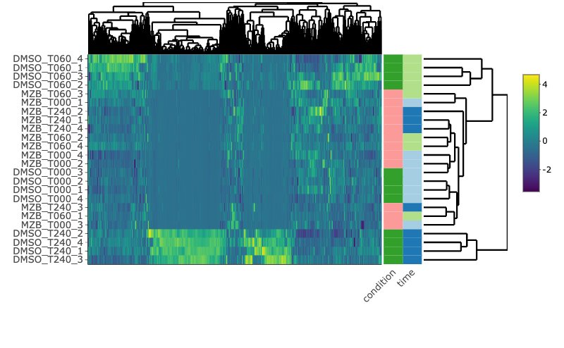

<!-- README.md is generated from README.Rmd. Please edit that file -->

```{r, include = FALSE}
knitr::opts_chunk$set(
  collapse = TRUE,
  comment = "#>",
  cache = TRUE
)
```

# msp-ms

<!-- badges: start -->
<!-- badges: end -->

The goal of mspms is provide a concise code-base for the normalization and data processing required to analyze data from the [Multiplex Substrate Profiling by Mass Spectrometry (MSP-MS) method](https://pubmed.ncbi.nlm.nih.gov/36948708/). 


Additionally, we provide a [graphical user interface powered by shiny apps](https://gonzalezlab.shinyapps.io/mspms_shiny/) that allows for a user to utilize the method without requiring any R coding knowledge. 


## Installation


You can install the released version of mspms from github

```{r,eval = FALSE}
devtools::install_github("baynec2/mspms")
```

## Workflow

So how does the msps data normalization process work?

1. Takes two input files from PEAKS and combines them
3. Normalizes values and then does a reverse log2 transformation
4. Looks for outliers across replicates. Removes them. 
5. Imputes data for missing values (likely to be very low intesity).
6. Figures out the locations of the detected clevages within the library of peptide sequences used. Is it cleaved at the N or C terminus, or both?

This package also contains tools for doing some basic statistics and data visualizations.   

7. Calculates the fold change and the p/q value across experimental conditions using T-tests.   
8. Conducts ANOVA tests to determine if there are any peptides that are significantly different across all time points.  
9. Conducts a hierarchical clustering analysis to visualize overall patterns in the data.  


### Combining Peaks file outputs

All analysis performed by this package is downstream of the data generated by the PEAKS software. The first step is to combine the two files generated by PEAKS.

The files coming from peaks should be generated according to the instructions found [here](www/PeaksDataAnalysis_howto.pdf).


```{r}
library(dplyr)
library(mspms)

### Loading the files ###
lfq_filename = "test/protein-peptides-lfq.csv"
#file "protein-peptides.csv" exported from PEAKS identification
id_filename = "test/protein-peptides-id.csv"

# Prepare the data for normalyzer analysis
prepared_data = prepare_for_normalyzer(lfq_filename,id_filename)


# saving to data folder in package for tests. Ignore when using on your own data
usethis::use_data(prepared_data,overwrite = TRUE)
```


### Loading design matrix

Before we normalyze data, we need to know what samples are in what groups. We can do that by defining a design matrix. 
```{r}
design_matrix = readr::read_csv("test/design_matrix.csv")

head(design_matrix)

```
### Normalyzing data

msp-ms uses the .... package to do normalization under the hood. 


Now we can normalyze the data.
```{r}
normalyzed_data = normalyze(prepared_data,design_matrix)

# saving to data folder in package for tests. Ignore when using on your own data
usethis::use_data(normalyzed_data,overwrite = TRUE)
```

### Handling Outliers

Here we use a dixon test from the outliers package to detect outliers from each of our replicates. We need to know what samples are part of which groups, so we need to specify the design matrix here too. Make sure that the column header names are "sample" and "group" just like before.

```{r}
design_matrix = readr::read_csv("test/design_matrix.csv")
outliers = handle_outliers(normalyzed_data,design_matrix)

# saving to data folder in package for tests. Ignore when using on your own data
usethis::use_data(outliers,overwrite = TRUE)
```

### Imputation of data 

We have a lot of missing, or 0 values. For these, we need to impute them so we can do downstream statistics
Data is imputated by ....

```{r}
imputed = impute(outliers)

# saving to data folder in package for tests. Ignore when using on your own data
usethis::use_data(imputed,overwrite = TRUE)
```


### Joining with Library

Next we need to join everything with the sequences of the peptide library
```{r}
joined_with_library = join_with_library(imputed)

# saving to data folder in package for tests. Ignore when using on your own data
usethis::use_data(joined_with_library,overwrite = TRUE)
```


### Calcuating clevages. 

Next, we need to determine where the peptide sequences are cleaved. 

We check both the N and C terminus. 

Sequences are presented as the user specified number of amino acids on both sides of a cleavage. The default is 4, but there is interest in looking at motifs that are farther away from the cut site. Note that X indicates that there was nothing on that side in the library because it was cleaved close to the edge. 

```{r}
cleavage_added_data = add_cleavages(joined_with_library,n_residues = 4)

head(cleavage_added_data)

# saving to data folder in package for tests. Ignore when using on your own data
usethis::use_data(cleavage_added_data,overwrite = TRUE)
```

### polishing

Someimes there is a need to polish the data a bit for downstream analysis. This function does that by removing combining the cterm and nterm cleavage information into one column while removing any rows that don't have any cleavage information or have cleavage information on the cterm and nterm.

```{r}
polished_data = polish(cleavage_added_data)
```


### Conducting stats

mspms provides a number of convenience functions to conduct statistics on the data. 


First, we need to prepare the data for stats. This involves reshaping the data into the long format so it is easy to conduct statistics on and then appending the data in the design matrix that allows us to determine what sample contains what conditions/time and conduct the appropriate statistics. 

```{r}
prepared_for_stats = prepare_for_stats(cleavage_added_data,design_matrix)

usethis::use_data(prepared_for_stats,overwrite = TRUE)
```

Noe we can conduct the statistics.

#### T tests

Ttests are performed within each condition and compared to time 0.

For example, for an experiment where there are two conditions, DMSO and MZB as well as 3 time points, 0, 1, and 2, the t tests would be as follows:

* DMSO.TO vs DMSO.T0. 
* DMSO.T0 vs DMSO.T1. 
* DMSO.T0 vs DMSO.T2. 

* MZB.T0 vs MZB.T0. 
* MZB.T0 vs MZB.T1. 
* MZB.T0 vs MZB.T2. 

```{r}
# Perform T test
t_test_stats = mspms::mspms_t_tests(prepared_for_stats)
```

#### log2FC

We can also calculate the log 2 fc. The comparisons here are the same as for the T tests
```{r}
# calclulate log2fc
log2fc = mspms::mspms_log2fc(prepared_for_stats)

head(log2fc)
```


#### log2fc_t_tests. 
Sometimes (such as when you want to make volcano plots) it is useful to look at the log2fc and the t test statistics at the same time. This function does that.  

```{r}
log2fc_t_test = mspms::log2fc_t_test(prepared_for_stats)

head(log2fc_t_test)
```


Now that we have this data we can visualize these results easily using the ggplot2 package. 

```{r}
library(ggplot2)

p1 = log2fc_t_test %>% 
  ggplot(aes(x = log2fc,y = -log10(p.adj)))+
  geom_point(size =0.5)+
  geom_hline(yintercept = -log10(0.05),linetype = "dashed",color = "red")+
  geom_vline(xintercept = 3, linetype = "dashed",color = "red")+
  geom_vline(xintercept = -3, linetype = "dashed",color = "red")+
  theme_minimal()+
  labs(x = "Log2 Fold Change",y = "-log10(p value)")+
  facet_wrap(~comparison,scales = "free")

p1
```

#### ANOVA

We also might want to perfom an anova. Here, we have it set up to show the effect of time within each condition. 

For example, for an experiment where there are two conditions, DMSO and MZB as well as 3 time points, 0, 1, and 2, the anova would statistics for the effect of time for each peptide within DMSO or MZB. 

```{r}
# Doing ANOVA
anova_stats = mspms::mspms_anova(prepared_for_stats)

head(anova_stats)
```

### Common Data Visualizations

We also provide some functions that make common data visualizations easier.


#### PCA 

We can generate a PCA plot to visualize the data. Here, the colors show the different time points while the shape shows the different conditions.  

```{r}

mspms::plot_pca(prepared_for_stats)
```

#### Hierchical clustering

We can also generate an interactive heatmap with the hierchical clustering results. 

The format of this readme does not allow for interactivity, so a static picture of the output is shown instead. 

```{r,eval = FALSE}

mspms::plot_heatmap(prepared_for_stats)

```


  
#### Ploting time course.  

We also provide a function for plotting the mean intensity and standard deviation over time for each peptide in the data set by conditions. Facets show peptide, color shows the condition. 

This is best used in combination with the ANOVA function. Below, we will use anova to calculate the peptides where we see an effect of time (in the DMSO group), and then plot these.

```{r}

top10sig = anova_stats %>% 
  arrange(p.adj) %>%
  pull(Peptide) %>% 
  head(10)


p1 = prepared_for_stats %>%
  dplyr::filter(Peptide %in% top10sig) %>%
  mspms::plot_time_course()

p1
```


