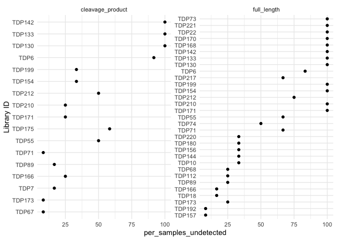
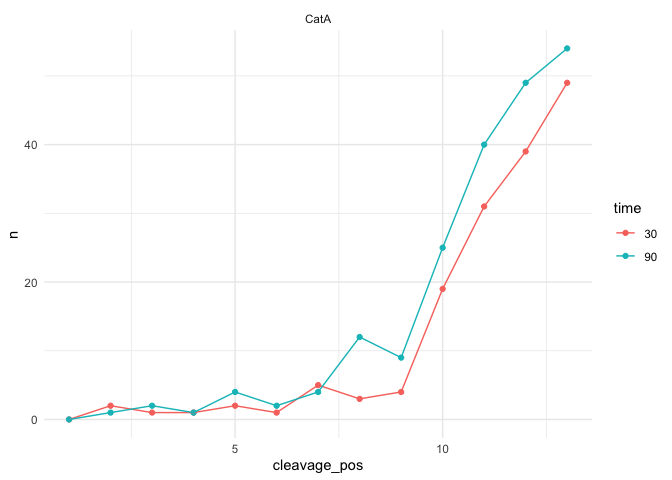

<!-- README.md is generated from README.Rmd. Please edit that file -->

# mspms

<!-- badges: start -->

[](https://github.com/baynec2/mspms/actions/workflows/R-CMD-check.yaml)
[](https://app.codecov.io/gh/baynec2/mspms?branch=main)
[](https://bioconductor.org/checkResults/release/bioc-LATEST/mspms)

<!-- badges: end -->

The goal of mspms is provide a R Package that can be used to analyze
data from the [Multiplex Substrate Profiling by Mass Spectrometry
(MSP-MS) method](https://pubmed.ncbi.nlm.nih.gov/36948708/).

Additionally, we provide a [graphical user interface powered by shiny
apps](https://gonzalezlab.shinyapps.io/mspms_shiny/) that allows for a
user to utilize the method without requiring any R coding knowledge.

## Installation

You can install the development version of mspms from github.

``` r
devtools::install_github("baynec2/mspms",
                         ref = "develop")
```

## Quickstart

To generate a general report using your own data, run the following
code. It requires data that has been prepared for mspms data analysis by
a converter function, and a design matrix. For more information see
subsequent sections.

``` r
mspms::generate_report(
  prepared_data = mspms::peaks_prepared_data,
  colData = mspms::design_matrix,
  outdir = "../Desktop/mspms_report"
)
```

The above command will generate a .html file containing a generic mspms
analysis.

There is much more that can be done using the mspms package- see the
following sections for more information.

## Overview

Functions in this package are logically divided into 4 broad types of
functions.

1.  Pre-processing data. These functions are focused on getting all of
    the data necessary for a mspms analysis together and in a consistent
    format.

2.  Data processing. These functions allow the user to process the
    proteomics data (imputation, normalization, etc).

3.  Statistics. These methods allow the user to perform basic statistics
    on the normalized/processed data.

4.  Data visualization. These functions allow the user to visualize the
    data.

**Note that only a subset of functions are exported to the user.**
Helper functions can be found in the \_helper_functions.R files.

## Pre-processing data

Pre-processing data here refers to standardizing the data exported from
different software solutions for analyzing mass spectrometry-based
proteomics and adding useful information specific to the MSP-MS assay.

Specifically, the data from the file exported from the upstream software
is parsed to contain the **peptide** (detected peptide sequence,
cleavages are represented as “\_”), **library_id** (name of the peptide
in the peptide library each detected peptide maps to), and intensities
for each sample.

Information about each peptide relative to the peptide it was derived
from is then added. This includes the **cleavage_seq** (the motif the
peptide a user specified n residues up and down from the cleavage
event), **cleavage_pos** (position of the peptide library the cleavage
product was cleaved at ), **peptide_type** (whether the detected peptide
is a cleavage product of the peptide library, or a full length member of
the peptide library).

All of the information is then loaded as a QFeatures object along with
colData (metadata about each sample) where it is stored as a
SummarizedExperiment object named “peptides”.

#### Uploading your colData

As briefly described above, the colData contains metadata describing the
samples you are trying to analyze.

It is very important that this contains at least the following columns
-“quantCols”,“group”,“condition”,and “time”.

The quantCols field contains the name of each sample. These names must
match whatever the samples are named in the files exported from the
upstream proteomics software.

The group field contains text specifying what group each sample belongs
to. All replicate samples should have the same group name

The condition field contains the experimental conditions that vary in
your MSP-MS experiment (this depends on the experimental question, could
be type of protease, the type of inhibitor, etc)

The time field contains the duration of incubation of your protease of
interest with the peptide library for each sample.

An example of a valid colData file is shown below.

``` r
colData = readr::read_csv("inst/extdata/colData.csv")
#> Rows: 42 Columns: 4
#> ── Column specification ────────────────────────────────────────────────────────
#> Delimiter: ","
#> chr (3): quantCols, group, condition
#> dbl (1): time
#> 
#> ℹ Use `spec()` to retrieve the full column specification for this data.
#> ℹ Specify the column types or set `show_col_types = FALSE` to quiet this message.
usethis::use_data(colData,overwrite = TRUE)
#> ✔ Setting active project to "/Users/charliebayne/mspms".
#> ✔ Saving "colData" to "data/colData.rda".
#> ☐ Document your data (see <https://r-pkgs.org/data.html>).

head(colData)
#> # A tibble: 6 × 4
#>   quantCols   group     condition  time
#>   <chr>       <chr>     <chr>     <dbl>
#> 1 CatA_0000_1 CatA_0000 CatA          0
#> 2 CatA_0000_2 CatA_0000 CatA          0
#> 3 CatA_0000_3 CatA_0000 CatA          0
#> 4 CatA_0000_4 CatA_0000 CatA          0
#> 5 CatA_0030_1 CatA_0030 CatA         30
#> 6 CatA_0030_2 CatA_0030 CatA         30
```

#### PEAKS

Analysis using a .csv exported from [PEAKS
software](https://www.bioinfor.com/peaks-studio/) is supported.

an exported .csv file can be generated from PEAKS as follows:

1.  Create a New Project in PEAKS.  
2.  Select data to add to PEAKS project.  
3.  Add data, rename samples, set correct parameters. • Highlight all
    the added data.  
    • Select Create new sample for each file.  
    • Select appropriate instrument and fragmentation method.  
    • Set Enzyme to “None”.  
    • Rename samples according to enzymes, time points, and
    replicates.  
    • Can also ensure appropriate data is selected for these.  
    • Select “Data Refinement” to continue.  
4.  Data Refinement.  
    • On the top right, select MSP-MS as the predefined parameters.  
    • Parameters shown are what should be used for MSP-MS data
    analysis.  
    • Select “Identification” to continue.  
5.  Peptide Identification.  
    • On the top right, select MSP-MS as the predefined parameters.  
    • Parameters shown are what should be used for MSP-MS data
    analysis.  
    • Identification -\> Select Database -\> TPD_237.  
    • Identification -\> no PTMs.  
    • Can remove the PTMs by highlighting them and selecting Remove  
6.  Label Free Quantification.  
    • Make sure Label Free is selected.  
    • Group samples -\> add quadruplicates of samples to new group.

``` r
library(dplyr)
#> 
#> Attaching package: 'dplyr'
#> The following objects are masked from 'package:stats':
#> 
#>     filter, lag
#> The following objects are masked from 'package:base':
#> 
#>     intersect, setdiff, setequal, union
library(mspms)
#> 
#> Attaching package: 'mspms'
#> The following object is masked _by_ '.GlobalEnv':
#> 
#>     colData

# File path of peaks lfq file
lfq_filename <- "inst/extdata/peaks_protein-peptides-lfq.csv"

# Prepare the data 
peaks_prepared_data <- mspms::prepare_peaks(lfq_filename,
                                            colData,
                                            0.3,
                                            n_residues = 4)
#> Rows: 2444 Columns: 70
#> ── Column specification ────────────────────────────────────────────────────────
#> Delimiter: ","
#> chr  (6): Protein Accession, Peptide, Used, Candidate, Sample Profile (Ratio...
#> dbl (63): Protein Group, Protein ID, Quality, Significance, Avg. ppm, Avg. A...
#> lgl  (1): PTM
#> 
#> ℹ Use `spec()` to retrieve the full column specification for this data.
#> ℹ Specify the column types or set `show_col_types = FALSE` to quiet this message.
#> [1] "841 peptides were removed because they had a quality score < 0.3 (34%)"
#> Checking arguments.
#> Loading data as a 'SummarizedExperiment' object.
#> Formatting sample annotations (colData).
#> Formatting data as a 'QFeatures' object.

usethis::use_data(peaks_prepared_data,overwrite = TRUE)
#> ✔ Saving "peaks_prepared_data" to "data/peaks_prepared_data.rda".
#> ☐ Document your data (see <https://r-pkgs.org/data.html>).

peaks_prepared_data
#> An instance of class QFeatures containing 1 assays:
#>  [1] peptides: SummarizedExperiment with 2071 rows and 42 columns
```

#### Proteome Discoverer

Analysis using a .csv file exported from [proteome
discoverer](https://www.thermofisher.com/us/en/home/industrial/mass-spectrometry/liquid-chromatography-mass-spectrometry-lc-ms/lc-ms-software/multi-omics-data-analysis/proteome-discoverer-software.html)
is supported.

To generate this .csv file:

#### Fragpipe

Data exported from [Fragpipe](https://github.com/Nesvilab/FragPipe) as a
.tsv file is supported.

To generate this file, run a [LFQ Fragpipe
workflow](https://fragpipe.nesvilab.org/docs/tutorial_lfq.html) using
your desired parameters (we recommend using match between runs).

You will find a file named “combined_peptide.tsv” in the output folder
from Fragpipe.

This can be loaded into mspms as follows:

``` r
lfq_file_path = "inst/extdata/fragpipe_combined_peptide.tsv"

fragpipe_prepared_data = prepare_fragpipe(lfq_file_path,
                                          colData)
#> Rows: 1911 Columns: 182
#> ── Column specification ────────────────────────────────────────────────────────
#> Delimiter: "\t"
#> chr  (50): Peptide Sequence, Prev AA, Next AA, Protein, Protein ID, Entry Na...
#> dbl (129): Start, End, Peptide Length, CatA_0000_1 Spectral Count, CatA_0000...
#> num   (1): Charges
#> lgl   (2): Mapped Genes, Mapped Proteins
#> 
#> ℹ Use `spec()` to retrieve the full column specification for this data.
#> ℹ Specify the column types or set `show_col_types = FALSE` to quiet this message.
#> Checking arguments.
#> 
#> Loading data as a 'SummarizedExperiment' object.
#> 
#> Formatting sample annotations (colData).
#> 
#> Formatting data as a 'QFeatures' object.

fragpipe_prepared_data
#> An instance of class QFeatures containing 1 assays:
#>  [1] peptides: SummarizedExperiment with 1694 rows and 42 columns
```

## Data Processing

Data processing includes imputation and normalization of the proteomics
data.

**Add more info**

``` r
# does set seed matter?
set.seed(2)
processed_qf = process_qf(peaks_prepared_data)
#> Loading required namespace: imputeLCMD
#> Imputing along margin 2 (samples/columns).
#> Your row data contain missing values. Please read the relevant
#> section(s) in the aggregateFeatures manual page regarding the effects
#> of missing values on data aggregation.

usethis::use_data(processed_qf,overwrite = TRUE)
#> ✔ Saving "processed_qf" to "data/processed_qf.rda".
#> ☐ Document your data (see <https://r-pkgs.org/data.html>).

processed_qf
#> An instance of class QFeatures containing 5 assays:
#>  [1] peptides: SummarizedExperiment with 2071 rows and 42 columns 
#>  [2] peptides_log: SummarizedExperiment with 2071 rows and 42 columns 
#>  [3] peptides_log_norm: SummarizedExperiment with 2071 rows and 42 columns 
#>  [4] peptides_log_impute_norm: SummarizedExperiment with 2071 rows and 42 columns 
#>  [5] peptides_norm: SummarizedExperiment with 2071 rows and 42 columns
```

## Statistics

MSP-MS analysis has traditionally used T-tests to what peptides are
significantly different relative to T0. The authors of the assay suggest
using a T-test derived FDR adjusted p value threshold \<= 0.05 and log2
fold change threshold \>= 3.

We provide a user-friendly implementation of this statistical test as
follows:

``` r
log2fc_t_test_data = mspms::log2fc_t_test(processed_qf = processed_qf) 
#> Joining with `by = join_by(quantCols)`
#> Joining with `by = join_by(quantCols)`

usethis::use_data(log2fc_t_test_data,overwrite = TRUE)
#> ✔ Saving "log2fc_t_test_data" to "data/log2fc_t_test_data.rda".
#> ☐ Document your data (see <https://r-pkgs.org/data.html>).
```

Please note that statistical analyses are one of the strengths of the
Bioconductor project and several packages provide alternative
statistical approaches that are more flexible than t-tests and could be
used with the QFeatures objects produced by mspms.

This includes packages using empirical Bayesian approaches (see
[limma](https://bioconductor.org/packages/release/bioc/html/limma.html))
and mixed modelling (see
[msqrob2](https://bioconductor.org/packages/release/bioc/html/msqrob2.html)),
that are suited for proteomics data.

Users are encouraged to use these excellent packages.

## Data Visualizations

We provide a number of data visualizations as part of the mspms_package.

### QC Checks

A critical initial step in MSP-MS data analysis is a rigorous quality
control assessment. Given the reliance on a specific peptide library,
calculating the percentage of library peptides detected in each sample
provides a straightforward yet powerful indicator of data integrity.
Anomalously low detection rates signal potential instrument or
experimental problems.

We can see the percentage of the peptide library that were undetected
among each group of replicates as follows (for full length peptides a
threshold of ~\< 10 is considered good while for cleavage products a
threshold ~\< 5 is good):

``` r
plot_qc_check(processed_qf,
              full_length_threshold = 10,
              cleavage_product_threshold = 5)
#> Joining with `by = join_by(quantCols)`
```

<!-- -->

We can also see in what percentage of samples each peptide in the
peptide library were undetected in.

``` r
plot_nd_peptides(processed_qf)
#> Joining with `by = join_by(quantCols)`
```

<!-- -->

### Heatmap

We can inspect our data using an interactive heatmap as follows:

``` r
plot_heatmap(processed_qf)
#> Joining with `by = join_by(quantCols)`
```

<!-- -->

### PCA

We can also inspect our data using a PCA as follows.

``` r
plot_pca(processed_qf)
#> Joining with `by = join_by(quantCols)`
#> Too few points to calculate an ellipse
#> Warning: Removed 1 row containing missing values or values outside the scale range
#> (`geom_path()`).
```

<!-- -->

### Volcano plots

We can generate volcano plots showing the significant peptides from each
condition as follows:

``` r
plot_volcano(log2fc_t_test_data)
```

<!-- -->

### Cleavage Position Plots

We can also create plots showing the number of times we observe a
cleavage at each position of the peptide_library among a set of peptides
of interest.

We can do this as follows:

``` r
filtered_data = log2fc_t_test_data %>% 
  dplyr::filter(p.adj <= 0.05,log2fc > 3)

p1 = mspms::plot_cleavages_per_pos(filtered_data )

p1
```

<!-- -->

### iceLogo

[Icelogos](https://www.nature.com/articles/nmeth1109-786) are a method
for visualizing conserved patterns in protein sequences through
probability theory.

As part of the mspms R package, we have implemented the logic to
generate
[iceLogos](https://genesis.ugent.be/uvpublicdata/icelogo/iceLogo.pdf) in
R.

To use this, we first have to define a vector of cleavage sequences that
we are interested in. We will do this for the significant CatA cleavages
below.

``` r
catA_sig_cleavages = log2fc_t_test_data %>% 
  dplyr::filter(p.adj <= 0.05,log2fc > 3) %>% 
  dplyr::filter(condition == "CatA") %>% 
  dplyr::pull(cleavage_seq) %>% 
  unique()
```

We also need to know all of the possible cleavages we could see among
our peptide library. We can generate that as below:

``` r
all_possible_8mers_from_228_library = calculate_all_cleavages(mspms::peptide_library$library_real_sequence,
                                                              n_AA_after_cleavage = 4)

usethis::use_data(all_possible_8mers_from_228_library,overwrite = TRUE)
#> ✔ Saving "all_possible_8mers_from_228_library" to
#>   "data/all_possible_8mers_from_228_library.rda".
#> ☐ Document your data (see <https://r-pkgs.org/data.html>).
```

We can then generate an iceLogo relative to the background of all
possible cleavages in our peptide library like so:

``` r
plot_icelogo(catA_sig_cleavages,
             background_universe = all_possible_8mers_from_228_library)
#> Warning: Expected 9 pieces. Additional pieces discarded in 2052 rows [913, 914, 915,
#> 916, 917, 918, 919, 920, 921, 922, 923, 924, 925, 926, 927, 928, 929, 930, 931,
#> 932, ...].
#> Scale for x is already present.
#> Adding another scale for x, which will replace the existing scale.
```

<!-- -->

We also provide a function that conveniently plots all icelogos from all
conditions from the experiment all together.

``` r
sig_cleavages = log2fc_t_test_data %>% 
  dplyr::filter(p.adj <= 0.05,log2fc > 3) 

plot_all_icelogos(sig_cleavages)
#> Warning: Expected 9 pieces. Additional pieces discarded in 2052 rows [913, 914, 915,
#> 916, 917, 918, 919, 920, 921, 922, 923, 924, 925, 926, 927, 928, 929, 930, 931,
#> 932, ...].
#> Scale for x is already present.
#> Adding another scale for x, which will replace the existing scale.
#> Warning: Expected 9 pieces. Additional pieces discarded in 2052 rows [913, 914, 915,
#> 916, 917, 918, 919, 920, 921, 922, 923, 924, 925, 926, 927, 928, 929, 930, 931,
#> 932, ...].
#> Scale for x is already present.
#> Adding another scale for x, which will replace the existing scale.
#> Warning: Expected 9 pieces. Additional pieces discarded in 2052 rows [913, 914, 915,
#> 916, 917, 918, 919, 920, 921, 922, 923, 924, 925, 926, 927, 928, 929, 930, 931,
#> 932, ...].
#> Scale for x is already present.
#> Adding another scale for x, which will replace the existing scale.
#> Warning: Expected 9 pieces. Additional pieces discarded in 2052 rows [913, 914, 915,
#> 916, 917, 918, 919, 920, 921, 922, 923, 924, 925, 926, 927, 928, 929, 930, 931,
#> 932, ...].
#> Scale for x is already present.
#> Adding another scale for x, which will replace the existing scale.
```

<!-- -->

### Plotting a Time Course

We can also plot the intensities of peptides of interest over time.

First we need to define which peptides we are interested in. Here we
will use the t-test results, and look at the peptide with the max
log2fc.

``` r
max_log2fc_pep = log2fc_t_test_data %>% 
  dplyr::filter(p.adj <= 0.05,log2fc > 3) %>% 
  dplyr::filter(log2fc ==max(log2fc)) %>% 
  pull(peptide)
```

We can then filter our QFeatures object to only include this peptide

``` r
filter = QFeatures::VariableFilter(field = "peptide",
               value = max_log2fc_pep,
               condition = "==")


sel = QFeatures::filterFeatures(processed_qf,filter)
#> 'peptide' found in 5 out of 5 assay(s)
```

And then plot as follows:

``` r
plot_time_course(sel,summarize_by_mean = FALSE)
#> Joining with `by = join_by(quantCols)`
#> Warning: The `fun.y` argument of `stat_summary()` is deprecated as of ggplot2 3.3.0.
#> ℹ Please use the `fun` argument instead.
#> ℹ The deprecated feature was likely used in the mspms package.
#>   Please report the issue at <https://github.com/baynec2/mspms/issues>.
#> This warning is displayed once every 8 hours.
#> Call `lifecycle::last_lifecycle_warnings()` to see where this warning was
#> generated.
```

<!-- -->
