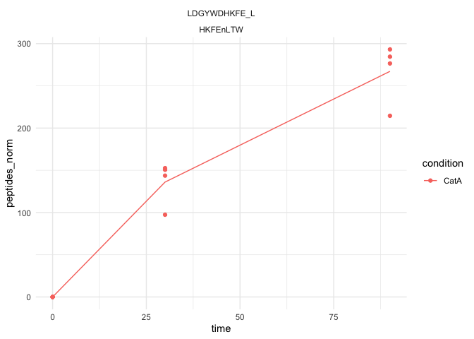
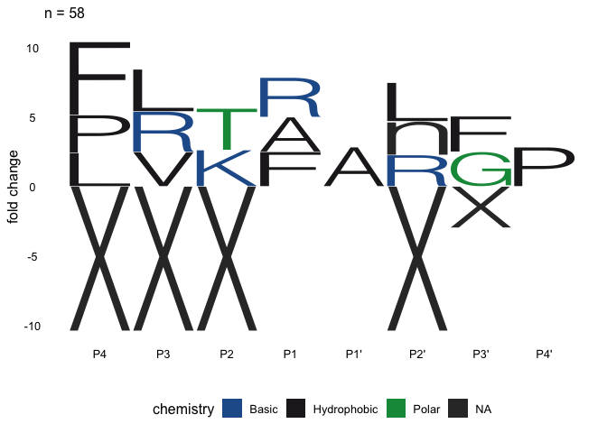

<!-- README.md is generated from README.Rmd. Please edit that file -->

# mspms

<!-- badges: start -->

[](https://github.com/baynec2/mspms/actions/workflows/R-CMD-check.yaml)
[](https://app.codecov.io/gh/baynec2/mspms?branch=main)
[](https://bioconductor.org/checkResults/release/bioc-LATEST/mspms)
<!-- badges: end -->

The goal of mspms is provide a concise code-base for the normalization
and data processing required to analyze data from the [Multiplex
Substrate Profiling by Mass Spectrometry (MSP-MS)
method](https://pubmed.ncbi.nlm.nih.gov/36948708/).

Additionally, we provide a [graphical user interface powered by shiny
apps](https://gonzalezlab.shinyapps.io/mspms_shiny/) that allows for a
user to utilize the method without requiring any R coding knowledge.

## Installation

You can install the development version of mspms from github.

``` r
devtools::install_github("baynec2/mspms",
                         ref = "develop")
```

## Quickstart

To generate a general report using your own data, run the following
code. It requires data that has been prepared for mspms data analysis by
a converter function, and a design matrix. For more information see
subsequent sections.

``` r
mspms::generate_report(
  prepared_data = mspms::peaks_prepared_data,
  design_matrix = mspms::design_matrix,
  outdir = "../Desktop/mspms_report"
)
```

The above command will generate a .html file containing a general mspms
analysis.

There is much more that can be done using the mspms package- see the
following sections for more information.

## Overview

There are 4 different types of functions in this package.

1.  Making mspms generically useful. These functions are focused on
    making mspms more generally useful to a wider audience outside of
    the very specific workflow traditionally used in the O’Donoghue lab.
    Allows for the use of other types of upstream proteomic data
    processing, different peptide libraries, etc.

2.  Data processing/ normalization. These functions allow the user to
    normalize and process the MSP-MS data.

3.  Statistics. These methods allow the user to perform basic statistics
    on the normalized/processed data.

4.  Data visualization. These functions allow the user to visualize the
    data.

**Making mspms generically useful**.  
1. *prepare_peaks()*:Takes two input files from PEAKS and combines them.
2. *prepare_pd()*: prepares exported files from proteome discoverer.  
3. *calculate_all_cleavages()*: Calculates all possible cleavages for
peptide library sequences.

**Data Processing/ Normalization**.  
1. *normalyze()*: Normalizes values.  
2. *handle_outliers()*: Looks for outliers across replicates. Removes
them.  
3. *impute()*: Imputes data for missing values (not including NAs
introduced by handle_outliers()).  
4. *join_with_library()*: Joins the normalized data with the peptide
library sequences.  
5. *add_cleavages()*: Figures out the locations of the detected
cleavages within the library of peptide sequences used. Is it cleaved at
the N or C terminus, or both? Uses *cterm_cleavage()* and
*nterm_cleavage()* to do this.  
6. *polish()*: combines the cleavage info into one column. Discards
peptides that were cleaved on both sides or not at all.  
7. *prepare_for_stats()*: Reshapes the data into a long format and
appends the data in the design matrix to make statistical testing easy
to perform.  
8 *mspms():* combines all of the above functions into one convenient
function.

**Calculations/ Statistics**.  
1. *mspms_log2fc()*: Calculates the log2 fold change across experimental
conditions relative to T0.  
2.*mspms_t_tests()*: Conducts T-tests to determine if there are any
peptides that are significantly different across experimental conditions
relative to time 0.  
3. *log2fc_t_test()*: Combines results from mspms_log2fc() and
mspms_t_tests() into one convenient tibble.  
4. *log2fct_condition()*: Calculates the log2 fold change and t tests
for the specified condition at a user specified time.  
5.*log2fct_time()*: Calculates the log2 fold change and t tests between
the specified times within a user specified time.  
6. *mspms_anova()*: Conducts ANOVA tests to determine if there are any
peptides that are significantly different across all time points.  
7. *count_cleavages_per_pos():* Counts the number of cleavages at each
position of the library. Useful for determining endoprotease vs
exoprotease activity.

**Data Visualization**.  
1. *plot_heatmap()*: Conducts hierarchical clustering analysis and plots
an interactive heatmap to visualize overall patterns in the data.  
2. *plot_pca()*: PCA analysis to visualize the data in a 2D space.  
3. *plot_time_course()*: Plot peptides over time by condition.  
4. *plot_cleavages_per_pos()*: Plot the number of cleavages at each
position in the library.Useful for determining endoprotease vs
exoprotease activity.

**Icelogo**.

1.  *calc_AA_count_of_motif()*: calculates the count of each amino acid
    at each position in a vector of motifs.  
2.  *calc_AA_prop_of_motif()*: calculates the proportion of each amino
    acid at each position from the output of calc_AA_count_of_motif().  
3.  *calc_AA_motif_zscore()*: calculates z scores for each amino acid at
    each position in a vector of motifs.  
4.  *calc_AA_percent_difference()*: calculates the percentage difference
    of
5.  *prepare_sig_p_dif()*: prepares the data for plotting percent
    difference icelogos. Removes AAs at positions that are not
    significantly different.  
6.  *prepare_fc()*: prepares the data for plotting fold change icelogos.
    Removes AAs at positions that are not significantly different.  
7.  *plot_pd_icelogo()*: plots a percent difference icelogo.  
8.  *plot_fc_icelogo()*: plots a fold change ice logo.  
9.  *plot_icelogo()*: wraps plot_pd_icelogo() and plot_fc_icelogo() into
    one function.  
10. *plot_all_icelogos()*: convenience function to plot all icelogos
    relative to time 0 from an experiment.  
    **Reports**.
11. *generate_report()*: Generates a simple analysis of the mspms data
    that should be generically applicable to all mspms experiments.

## Making Generically Usefull.

### Formating Peaks File Outputs.

All analysis performed by this package is downstream of the data
generated by the PEAKS software. The first step is to combine the two
files generated by PEAKS.

The files coming from peaks should be generated according to the
instructions found [here](www/PeaksDataAnalysis_howto.pdf).

``` r
library(dplyr)
#> 
#> Attaching package: 'dplyr'
#> The following objects are masked from 'package:stats':
#> 
#>     filter, lag
#> The following objects are masked from 'package:base':
#> 
#>     intersect, setdiff, setequal, union
```

``` r
library(mspms)

### Loading the files ###
lfq_filename <- "tests/testdata/protein-peptides-lfq.csv"
# file "protein-peptides.csv" exported from PEAKS identification
id_filename <- "tests/testdata/protein-peptides-id.csv"

# Prepare the data for normalyzer analysis
peaks_prepared_data <- prepare_peaks(lfq_filename, id_filename)
#> Rows: 1099 Columns: 46
#> ── Column specification ────────────────────────────────────────────────────────
#> Delimiter: ","
#> chr  (6): Protein Accession, Peptide, Used, Candidate, Sample Profile (Ratio...
#> dbl (40): Protein Group, Protein ID, Quality, Significance, Avg. ppm, Avg. A...
#> 
#> ℹ Use `spec()` to retrieve the full column specification for this data.
#> ℹ Specify the column types or set `show_col_types = FALSE` to quiet this message.
#> Rows: 1381 Columns: 66
#> ── Column specification ────────────────────────────────────────────────────────
#> Delimiter: ","
#> chr  (4): Protein Accession, Peptide, Unique, Source File
#> dbl (62): Protein Group, Protein ID, -10lgP, Mass, Length, ppm, m/z, z, RT, ...
#> 
#> ℹ Use `spec()` to retrieve the full column specification for this data.
#> ℹ Specify the column types or set `show_col_types = FALSE` to quiet this message.
```

### Formating Proteome Discoverer File Outputs.

We can prepare proteome discover files for analysis with mspms as
follows.

``` r
prepared_proteome_discoverer <- prepare_pd("tests/testdata/proteome_discoverer_output.xlsx")
#> New names:
#> • `Abundance: F12: Sample, 4, 60 min` -> `Abundance: F12: Sample, 4, 60
#>   min...15`
#> • `Abundance: F12: Sample, 4, 60 min` -> `Abundance: F12: Sample, 4, 60
#>   min...19`
```

### Calculating all cleavages

We might want to calculate all possible cleavages for the peptide
library sequences. This is useful for downstream analysis, especially
when we are looking at the specificity of the cleavage sites via
plot_cleavage_motif() as this requires a background of all possible
cleavages

We can do this by specifying the number of amino acids after the
cleavage site that we are interested in. First lets try 4, which is the
default.

``` r
all_peptide_sequences <- mspms::calculate_all_cleavages(mspms::peptide_library$library_real_sequence,
  n_AA_after_cleavage = 4
)
head(all_peptide_sequences)
#> [1] "XXXLVATV" "XXXnLDKL" "XXXAVRAV" "XXXGIQST" "XXXSLNQA" "XXXFIVFI"
```

We could also try 5 AA after each cleavage site

``` r
all_peptide_sequences <- mspms::calculate_all_cleavages(mspms::peptide_library$library_real_sequence,
  n_AA_after_cleavage = 5
)
head(all_peptide_sequences)
#> [1] "XXXXLVATVY" "XXXXnLDKLn" "XXXXAVRAVE" "XXXXGIQSTY" "XXXXSLNQAY"
#> [6] "XXXXFIVFIL"
```

## Data Normalization/ Processing

### Loading design matrix

Before we normalyze data, we need to know what samples are in what
groups. We can do that by defining a design matrix.

``` r
design_matrix <- readr::read_csv("tests/testdata/design_matrix.csv")
#> Rows: 24 Columns: 4
#> ── Column specification ────────────────────────────────────────────────────────
#> Delimiter: ","
#> chr (3): sample, group, condition
#> dbl (1): time
#> 
#> ℹ Use `spec()` to retrieve the full column specification for this data.
#> ℹ Specify the column types or set `show_col_types = FALSE` to quiet this message.
```

``` r

head(design_matrix)
#> # A tibble: 6 × 4
#>   sample      group    condition  time
#>   <chr>       <chr>    <chr>     <dbl>
#> 1 DMSO_T000_1 DMSO_T0  DMSO          0
#> 2 DMSO_T000_2 DMSO_T0  DMSO          0
#> 3 DMSO_T000_3 DMSO_T0  DMSO          0
#> 4 DMSO_T000_4 DMSO_T0  DMSO          0
#> 5 DMSO_T060_1 DMSO_T60 DMSO         60
#> 6 DMSO_T060_2 DMSO_T60 DMSO         60
```

### Normalyzing data

mspms uses the NormalyzerDE package to do normalization under the hood.

We can normalyze the data as follows:

``` r
normalyzed_data <- normalyze(peaks_prepared_data, design_matrix)
#> You are running version 1.19.7 of NormalyzerDE
#> [Step 1/5] Load data and verify input
#> Input data checked. All fields are valid.
#> Sample check: More than one sample group found
#> Sample replication check: All samples have replicates
#> RT annotation column found (2)
#> [Step 1/5] Input verified, job directory prepared at:./2024-06-04_mspms_normalyze_output
#> [Step 2/5] Performing normalizations
#> [Step 2/5] Done!
#> [Step 3/5] Generating evaluation measures...
#> [Step 3/5] Done!
#> [Step 4/5] Writing matrices to file
#> [Step 4/5] Matrices successfully written
#> [Step 5/5] Generating plots...
#> [Step 5/5] Plots successfully generated
#> All done! Results are stored in: ./2024-06-04_mspms_normalyze_output, processing time was 0.3 minutes
#> Rows: 820 Columns: 27
#> ── Column specification ────────────────────────────────────────────────────────
#> Delimiter: "\t"
#> chr  (2): Peptide, Protein Accession
#> dbl (25): RT, DMSO_T000_1, DMSO_T000_2, DMSO_T000_3, DMSO_T000_4, DMSO_T060_...
#> 
#> ℹ Use `spec()` to retrieve the full column specification for this data.
#> ℹ Specify the column types or set `show_col_types = FALSE` to quiet this message.
```

### Handling Outliers

Here we use a Dixon test from the outliers package to detect outliers
from each of our replicates. We need to know what samples are part of
which groups, so we need to specify the design matrix here too. Make
sure that the column header names are “sample” and “group” just like
before.

``` r
design_matrix <- readr::read_csv("tests/testdata/design_matrix.csv")
#> Rows: 24 Columns: 4
#> ── Column specification ────────────────────────────────────────────────────────
#> Delimiter: ","
#> chr (3): sample, group, condition
#> dbl (1): time
#> 
#> ℹ Use `spec()` to retrieve the full column specification for this data.
#> ℹ Specify the column types or set `show_col_types = FALSE` to quiet this message.
```

``` r
outliers <- handle_outliers(normalyzed_data, design_matrix)
```

### Imputation of data

We have a lot of missing, or 0 values. For these, we need to impute them
so we can do downstream statistics.

``` r
imputed <- mspms::impute(outliers)
```

### Joining with Library

Next we need to join everything with the sequences of the peptide
library.

``` r
joined_with_library <- mspms::join_with_library(imputed)
```

### Calcuating cleavages.

Next, we need to determine where the peptide sequences are cleaved.

We check both the N and C terminus.

Sequences are presented as the user specified number of amino acids on
both sides of a cleavage. The default is 4, but there is interest in
looking at motifs that are farther away from the cut site. Note that X
indicates that there was nothing at that position because it is over the
end.

``` r
cleavage_added_data <- mspms::add_cleavages(joined_with_library, n_residues = 4)

head(cleavage_added_data)
#> # A tibble: 6 × 32
#>   Peptide      library_reference_id library_match_sequence library_real_sequence
#>   <chr>        <chr>                <chr>                  <chr>                
#> 1 LVATVYEFGHI… TDP1|TDP1|generatio… LVATVYEFGHIDHL         LVATVYEFGHIDHn       
#> 2 L_VATVYEFGH… TDP1|TDP1|generatio… LVATVYEFGHIDHL         LVATVYEFGHIDHn       
#> 3 T_VYEFGHIDHL TDP1|TDP1|generatio… LVATVYEFGHIDHL         LVATVYEFGHIDHn       
#> 4 A_TVYEFGHID… TDP1|TDP1|generatio… LVATVYEFGHIDHL         LVATVYEFGHIDHn       
#> 5 LVATVYEFGHI… TDP1|TDP1|generatio… LVATVYEFGHIDHL         LVATVYEFGHIDHn       
#> 6 LLDKLLNWPQR… TDP2|TDP2|generatio… LLDKLLNWPQRRGL         nLDKLnNWPQRRGn       
#> # ℹ 28 more variables: nterm <chr>, nterm_cleavage_pos <dbl>, cterm <chr>,
#> #   cterm_cleavage_pos <dbl>, DMSO_T060_1 <dbl>, DMSO_T060_2 <dbl>,
#> #   DMSO_T060_3 <dbl>, DMSO_T060_4 <dbl>, DMSO_T240_1 <dbl>, DMSO_T240_2 <dbl>,
#> #   DMSO_T240_3 <dbl>, DMSO_T240_4 <dbl>, MZB_T240_2 <dbl>, MZB_T240_3 <dbl>,
#> #   MZB_T240_1 <dbl>, MZB_T240_4 <dbl>, DMSO_T000_1 <dbl>, DMSO_T000_2 <dbl>,
#> #   DMSO_T000_3 <dbl>, DMSO_T000_4 <dbl>, MZB_T000_1 <dbl>, MZB_T000_2 <dbl>,
#> #   MZB_T000_3 <dbl>, MZB_T000_4 <dbl>, MZB_T060_1 <dbl>, MZB_T060_2 <dbl>, …
```

### Adding metadata back

We need to add information about our samples back to perform downstream
statistics on the data. We accomplish this with the prepare for stats
file.

``` r
prepared_for_stats <- mspms::prepare_for_stats(cleavage_added_data,
                                               design_matrix)
```

### Polishing

This function polishes the data by combining the cterm and nterm
cleavage information into one column while removing any rows that don’t
have any cleavage information or have cleavage information on the cterm
and nterm.

``` r
polished_data <- mspms::polish(cleavage_added_data)
```

### Complete workflow

There are a lot of steps to get to the final normalized data we listed
above. We have combined all of these steps into one function, mspms()
for convenience. This offers a nice balance between allowing the user
the option to use individual steps and providing a quick way to get to
the final data.

``` r
mspms_data <- mspms::mspms(peaks_prepared_data, design_matrix)
#> You are running version 1.19.7 of NormalyzerDE
#> [Step 1/5] Load data and verify input
#> Input data checked. All fields are valid.
#> Sample check: More than one sample group found
#> Sample replication check: All samples have replicates
#> RT annotation column found (2)
#> [Step 1/5] Input verified, job directory prepared at:./2024-06-04_mspms_normalyze_output
#> [Step 2/5] Performing normalizations
#> [Step 2/5] Done!
#> [Step 3/5] Generating evaluation measures...
#> [Step 3/5] Done!
#> [Step 4/5] Writing matrices to file
#> [Step 4/5] Matrices successfully written
#> [Step 5/5] Generating plots...
#> [Step 5/5] Plots successfully generated
#> All done! Results are stored in: ./2024-06-04_mspms_normalyze_output, processing time was 0.3 minutes
#> Rows: 820 Columns: 27
#> ── Column specification ────────────────────────────────────────────────────────
#> Delimiter: "\t"
#> chr  (2): Peptide, Protein Accession
#> dbl (25): RT, DMSO_T000_1, DMSO_T000_2, DMSO_T000_3, DMSO_T000_4, DMSO_T060_...
#> 
#> ℹ Use `spec()` to retrieve the full column specification for this data.
#> ℹ Specify the column types or set `show_col_types = FALSE` to quiet this message.
```

## Statistics

mspms provides a number of convenience functions to conduct statistics
on the data.

First, we need to prepare the data for stats. This involves reshaping
the data into the long format so it is easy to conduct statistics on and
then appending the data in the design matrix that allows us to determine
what sample contains what conditions/time and conduct the appropriate
statistics.

Now we can conduct the statistics:

### T tests

T tests are performed within each condition and compared to time 0.

For example, for an experiment where there are two conditions, DMSO and
MZB as well as 3 time points, 0, 1, and 2, the t tests would be as
follows:

- DMSO.TO vs DMSO.T0.

- DMSO.T0 vs DMSO.T1.

- DMSO.T0 vs DMSO.T2.

- MZB.T0 vs MZB.T0.

- MZB.T0 vs MZB.T1.

- MZB.T0 vs MZB.T2.

``` r
# Perform T test
t_test_stats <- mspms::mspms_t_tests(mspms_data)
```

### log2FC

We can also calculate the log 2 fold change. The comparisons here are
the same as for the T tests.

``` r
# calculate log2fc
log2fc <- mspms::mspms_log2fc(mspms_data)

head(log2fc)
#> # A tibble: 6 × 7
#>   condition Peptide         control_mean  time reference_mean comparison  log2fc
#>   <chr>     <chr>                  <dbl> <dbl>          <dbl> <chr>        <dbl>
#> 1 DMSO      AETSIKVFLPYYG_H       89862.     0         89862. DMSO.T0/DM…  0    
#> 2 DMSO      AETSIKVFLPYYG_H       89862.    60        186881. DMSO.T60/D…  1.06 
#> 3 DMSO      AETSIKVFLPYYG_H       89862.   240         81846. DMSO.T240/… -0.135
#> 4 DMSO      AETSIKVFL_P          144493.     0        144493. DMSO.T0/DM…  0    
#> 5 DMSO      AETSIKVFL_P          144493.    60        292380. DMSO.T60/D…  1.02 
#> 6 DMSO      AETSIKVFL_P          144493.   240          9256. DMSO.T240/… -3.96
```

### log2fc_t_tests.

Oftentimes (such as when you want to make volcano plots) it is most
useful to look at the log2fc and the t test statistics at the same time.

``` r
log2fc_t_test <- mspms::log2fc_t_test(mspms_data)

head(log2fc_t_test)
#> # A tibble: 6 × 19
#>   Peptide       control_mean time  reference_mean comparison log2fc cleavage_seq
#>   <chr>                <dbl> <chr>          <dbl> <chr>       <dbl> <chr>       
#> 1 AETSIKVFLPYY…       89862. 60           186881. DMSO.T60/…  1.06  PYYGHXXX    
#> 2 AETSIKVFLPYY…       89862. 240           81846. DMSO.T240… -0.135 PYYGHXXX    
#> 3 AETSIKVFL_P        144493. 60           292380. DMSO.T60/…  1.02  KVFnPYYG    
#> 4 AETSIKVFL_P        144493. 240            9256. DMSO.T240… -3.96  KVFnPYYG    
#> 5 AGSWKGVRNDF_T       68500. 60           137345. DMSO.T60/…  1.00  RNDFTEAX    
#> 6 AGSWKGVRNDF_T       68500. 240           11127. DMSO.T240… -2.62  RNDFTEAX    
#> # ℹ 12 more variables: cleavage_pos <dbl>, .y. <chr>, group1 <chr>,
#> #   group2 <fct>, n1 <int>, n2 <int>, statistic <dbl>, df <dbl>, p <dbl>,
#> #   p.adj <dbl>, p.adj.signif <chr>, condition <chr>
```

### log2fct_condition

You may wish to compare two conditions at a specific time point. This
function allows this

``` r
condition_t = mspms::log2fct_condition(mspms_data,
                                       ref_condition = "DMSO",
                                       comparison_condition = "MZB",
                                       at_time = 60)


head(condition_t)
#> # A tibble: 6 × 16
#>   Peptide         comparison_mean reference_mean log2fc comparison  cleavage_seq
#>   <chr>                     <dbl>          <dbl>  <dbl> <chr>       <chr>       
#> 1 AETSIKVFLPYYG_H          41680.        186881. -2.16  MZB/DMSO a… PYYGHXXX    
#> 2 AETSIKVFL_P              73350.        292380. -1.99  MZB/DMSO a… KVFnPYYG    
#> 3 AGSWKGVRNDF_T            98655.        137345. -0.477 MZB/DMSO a… RNDFTEAX    
#> 4 AGSWKGVRND_F              6667.         39644. -2.57  MZB/DMSO a… VRNDFTEA    
#> 5 AHLFNALTWPSG_H          112399.        101771.  0.143 MZB/DMSO a… WPSGHNXX    
#> 6 AKGLGPFHIV_K              7988.         98291. -3.62  MZB/DMSO a… FHIVKWAS    
#> # ℹ 10 more variables: cleavage_pos <dbl>, .y. <chr>, group1 <chr>,
#> #   group2 <chr>, n1 <int>, n2 <int>, statistic <dbl>, df <dbl>, p <dbl>,
#> #   p.adj <dbl>
```

### log2fct_time

You may wish to compare two time points within a specific condition.
This function allows

``` r
time_t = mspms::log2fct_time(mspms_data,
                             within_condition = "DMSO",
                             ref_time = 0,
                             comparison_time = 60)

head(time_t)
#> # A tibble: 6 × 15
#>   Peptide   comparison_mean reference_mean  log2fc comparison cleavage_seq .y.  
#>   <chr>               <dbl>          <dbl>   <dbl> <chr>      <chr>        <chr>
#> 1 AETSIKVF…         186881.         89862.  1.06   60/0 with… PYYGHXXX     value
#> 2 AETSIKVF…         292380.        144493.  1.02   60/0 with… KVFnPYYG     value
#> 3 AGSWKGVR…         137345.         68500.  1.00   60/0 with… RNDFTEAX     value
#> 4 AGSWKGVR…          39644.         21772.  0.865  60/0 with… VRNDFTEA     value
#> 5 AHLFNALT…         101771.        103382. -0.0227 60/0 with… WPSGHNXX     value
#> 6 AKGLGPFH…          98291.          8660.  3.50   60/0 with… FHIVKWAS     value
#> # ℹ 8 more variables: group1 <chr>, group2 <chr>, n1 <int>, n2 <int>,
#> #   statistic <dbl>, df <dbl>, p <dbl>, p.adj <dbl>
```

### ANOVA

We also might want to perform an anova. Here, we have it set up to show
the effect of time within each condition.

For example, for an experiment where there are two conditions, DMSO and
MZB as well as 3 time points, 0, 1, and 2, the anova would statistics
for the effect of time for each peptide within DMSO or MZB.

``` r
# Doing ANOVA
anova_stats <- mspms::mspms_anova(mspms_data)
#> Warning: There were 100 warnings in `mutate()`.
#> The first warning was:
#> ℹ In argument: `data = map(.data$data, .f, ...)`.
#> Caused by warning:
#> ! NA detected in rows: 6,12.
#> Removing this rows before the analysis.
#> ℹ Run `dplyr::last_dplyr_warnings()` to see the 99 remaining warnings.
```

``` r

head(anova_stats)
#> # A tibble: 6 × 11
#>   Peptide      cleavage_pos condition Effect   DFn   DFd       F       p `p<.05`
#>   <chr>               <dbl> <chr>     <chr>  <dbl> <dbl>   <dbl>   <dbl> <chr>  
#> 1 AETSIKVFLPY…           13 DMSO      time       1    10   0.347 5.69e-1 ""     
#> 2 AETSIKVFL_P             9 DMSO      time       1    10   3.32  9.8 e-2 ""     
#> 3 AGSWKGVRNDF…           11 DMSO      time       1    10   1.47  2.54e-1 ""     
#> 4 AGSWKGVRND_F           10 DMSO      time       1    10   0.501 4.95e-1 ""     
#> 5 AHLFNALTWPS…           12 DMSO      time       1    10   3.52  9   e-2 ""     
#> 6 AKGLGPFHIV_K           10 DMSO      time       1    10 268.    1.49e-8 "*"    
#> # ℹ 2 more variables: ges <dbl>, p.adj <dbl>
```

## Common Data Visualizations

We also provide some functions that make common data visualizations
easier.

### volcano plots

``` r
volcano_plot <- mspms::plot_volcano(log2fc_t_test)

volcano_plot
```

<!-- -->

### Plotting sequence specificity motif

Here use an approach similar to what is implemented in ICELOGO to
visualize the sequence specificity of the cleavage sites. This was used
as reference to build the code:
<https://iomics.ugent.be/icelogoserver/resources/manual.pdf>.

Below we can see this applied to see what cleavage sequences are
enriched among the peptides significantly different between time 0 and
time 60 within DMSO.

``` r
cleavage_seqs <- time_t %>%
  dplyr::filter(log2fc > 3, p.adj <= 0.05) %>%
  dplyr::pull(cleavage_seq)

background_universe <- mspms::all_possible_8mers_from_228_library


mspms::plot_icelogo(cleavage_seqs, background_universe)
#> Scale for x is already present.
#> Adding another scale for x, which will replace the existing scale.
```

<!-- -->

We could also look at the fold change instead of the percent difference

``` r
mspms::plot_icelogo(cleavage_seqs, background_universe, type = "fold change")
#> Scale for x is already present.
#> Adding another scale for x, which will replace the existing scale.
```

<!-- -->

We also provide a convenience function for looking at all icelogos
relative to time 0 within the experiment.

This function includes cleavages that were significant at any time point
once in the experimental set of the ICELOGO.

``` r
mspms::plot_all_icelogos(mspms_data)
#> Scale for x is already present.
#> Adding another scale for x, which will replace the existing scale.
```

<!-- -->

### PCA.

We can generate a PCA plot to visualize the data. Here, the colors show
the different time points while the shape shows the different
conditions.

``` r
mspms::plot_pca(mspms_data)
```

<!-- -->

### Hierchical clustering

We can also generate an interactive heatmap with the hierarchical
clustering results.

The format of this readme does not allow for interactivity, so a static
picture of the output is shown instead.

``` r
mspms::plot_heatmap(mspms_data)
```


### Ploting time course.

We also provide a function for plotting the mean intensity and standard
deviation over time for each peptide in the data set by conditions.
Facets show peptide, color shows the condition.

This can be used in combination with the ANOVA function. Below, we will
use anova to calculate the peptides where we see an effect of time (in
the DMSO group), and then plot these.

``` r

top10sig <- anova_stats %>%
  dplyr::arrange(p.adj) %>%
  dplyr::pull(Peptide) %>%
  head(10)


p1 <- mspms_data %>%
  dplyr::filter(Peptide %in% top10sig) %>%
  mspms::plot_time_course()

p1
```

<!-- -->

## Calculating the number of cleavages at each position in the library

We can also calculate the number of cleavages at each position of the
library. Here we will do this for peptides significantly different
relative to time 0 for DMSO and MZB.

``` r
# Performing T tests
t_tests = log2fc_t_test(mspms_data) %>% 
  dplyr::filter(p.adj < 0.05,
                log2fc > 3)

count = mspms::count_cleavages_per_pos(t_tests)

p1 = mspms:::plot_cleavages_per_pos(count)

p1
```

<!-- -->
