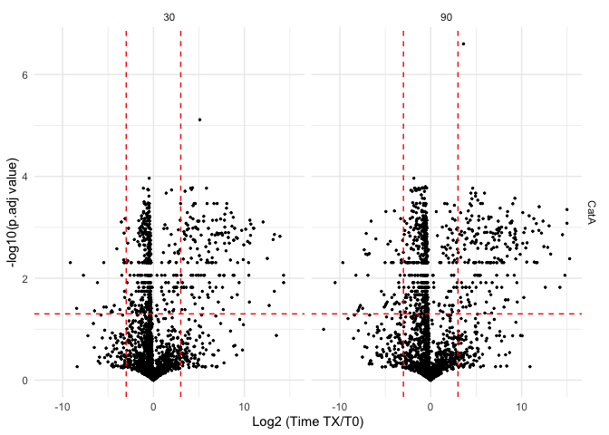

<!-- README.md is generated from README.Rmd. Please edit that file -->

# mspms

<!-- badges: start -->
<!-- badges: end -->

The goal of mspms is provide a concise code-base for the normalization
and data processing required to analyze data from the [Multiplex
Substrate Profiling by Mass Spectrometry (MSP-MS)
method](https://pubmed.ncbi.nlm.nih.gov/36948708/).

Additionally, we provide a [graphical user interface powered by shiny
apps](https://gonzalezlab.shinyapps.io/mspms_shiny/) that allows for a
user to utilize the method without requiring any R coding knowledge.

## Installation

You can install the released version of mspms from github

``` r
devtools::install_github("baynec2/mspms")
```

## Overview

There are 4 different types of functions in this package. Those that are
involved in:

1.  Making mspms generically useful. These functions are focused on
    making mspms more generally useful to a wider audience outside of
    the very specific workflow traditionally used in the O’Donoghue lab.
    Allows for the use of other types of upstream proteomic data
    processing, different peptide libraries, etc.

2.  Data processing/ normalization. These functions allow the user to
    normalize and process the MSP-MS data.

3.  Statistics. These methods allow the user to perform basic statistics
    on the normalyzed/processed data.

4.  Data visualization. These functions allow the user to visualize the
    data in a number of useful way.

**Making mspms generically useful**.  
1. *prepare_peaks()*:Takes two input files from PEAKS and combines them.
2. *prepare_pd()*: prepares exported files from proteome discoverer.  
- *extract_design_matrix_pd()*: Extracts the design matrix from the
proteome discoverer file.  
3. *prepare_spectronaut()*: prepares exported files from spectronaut -
note in development, not yet implemented.  
4. *calculate_all_cleavages()*: Calculates all possible cleavages for
peptide library sequences.

**Data Proessing/ Normalization**. 1. *normalyze()*: Normalizes values
and then does a reverse log2 transformation.  
2. *handle_outliers()*: Looks for outliers across replicates. Removes
them.  
3. *impute()*: Imputes data for missing values (not including NAs
introduced by handle_outliers()).  
4. *join_with_library()*: Joins the normalyzed data with the peptide
library sequences.  
5. *add_cleavages()*: Figures out the locations of the detected clevages
within the library of peptide sequences used. Is it cleaved at the N or
C terminus, or both? Uses *cterm_cleavage()* and *nterm_cleavage()* to
do this.  
6. *polish()*: combines the cleavage info into one column. Discards
peptides that were cleaved on both sides or not at all.  
7. *prepare_for_stats()*: Reshapes the data into a long format and
appends the data in the design matrix to make statistical testing easy
to perform.

**Statistics**.  
1. *log2fc_t_test()*: Calculates the fold change and the p/q value
across experimental conditions using T-tests.  
2. *mspms_anova()*: Conducts ANOVA tests to determine if there are any
peptides that are significantly different across all time points.

**Data Visualization**.  
1. *plot_heatmap()*: Conducts hierarchical clustering analysis and plots
an interactive heatmap to visualize overall patterns in the data.  
2. *plot_pca()*: PCA analysis to visualize the data in a 2D space.  
3. *plot_time_course()*: Plot peptides over time by condition.  
4. *plot_cleavage_motif()*: Visualize the sequence specificity of the
cleavage sites. Designed to be similar to what is implemented in
IceLogo.

## Making Generically Usefull.

### Formating Peaks File Outputs.

All analysis performed by this package is downstream of the data
generated by the PEAKS software. The first step is to combine the two
files generated by PEAKS.

The files coming from peaks should be generated according to the
instructions found [here](www/PeaksDataAnalysis_howto.pdf).

``` r
library(dplyr)
library(mspms)

### Loading the files ###
lfq_filename = "tests/protein-peptides-lfq.csv"
#file "protein-peptides.csv" exported from PEAKS identification
id_filename = "tests/protein-peptides-id.csv"

# Prepare the data for normalyzer analysis
prepared_data = prepare_peaks(lfq_filename,id_filename)
#> Warning: One or more parsing issues, call `problems()` on your data frame for details,
#> e.g.:
#>   dat <- vroom(...)
#>   problems(dat)
#> Rows: 1099 Columns: 46
#> ── Column specification ────────────────────────────────────────────────────────
#> Delimiter: ","
#> chr  (6): Protein Accession, Peptide, Used, Candidate, Sample Profile (Ratio...
#> dbl (40): Protein Group, Protein ID, Quality, Significance, Avg. ppm, Avg. A...
#> 
#> ℹ Use `spec()` to retrieve the full column specification for this data.
#> ℹ Specify the column types or set `show_col_types = FALSE` to quiet this message.
#> Rows: 1381 Columns: 66
#> ── Column specification ────────────────────────────────────────────────────────
#> Delimiter: ","
#> chr  (4): Protein Accession, Peptide, Unique, Source File
#> dbl (62): Protein Group, Protein ID, -10lgP, Mass, Length, ppm, m/z, z, RT, ...
#> 
#> ℹ Use `spec()` to retrieve the full column specification for this data.
#> ℹ Specify the column types or set `show_col_types = FALSE` to quiet this message.
#> Warning: `as.tibble()` was deprecated in tibble 2.0.0.
#> ℹ Please use `as_tibble()` instead.
#> ℹ The signature and semantics have changed, see `?as_tibble`.
#> ℹ The deprecated feature was likely used in the mspms package.
#>   Please report the issue to the authors.
#> This warning is displayed once every 8 hours.
#> Call `lifecycle::last_lifecycle_warnings()` to see where this warning was
#> generated.


# saving to data folder in package for tests. Ignore when using on your own data
usethis::use_data(prepared_data,overwrite = TRUE)
#> ✔ Setting active project to '/Users/charliebayne/mspms'
#> ✔ Saving 'prepared_data' to 'data/prepared_data.rda'
#> • Document your data (see 'https://r-pkgs.org/data.html')
```

### Calculating all cleavages

We might want to calculate all possible cleavages for the peptide
library sequences. This is useful for downstream analysis, especially
when we are looking at the specificity of the cleavage sites via as this
requires a background of all possible cleavages

We can do this by specifying the number of amino acids after the
cleavage site that we are interested in. First lets try 4, which is the
default.

``` r
all_peptide_sequences = mspms::calculate_all_cleavages(mspms::peptide_library$library_real_sequence,
                        n_AA_after_cleavage=4)
head(all_peptide_sequences)
#> [1] "XXXLVATV" "XXXMLDKL" "XXXAVRAV" "XXXGIQST" "XXXSLNQA" "XXXFIVFI"
```

We could also try 5 AA after each cleavage site

``` r
all_peptide_sequences = mspms::calculate_all_cleavages(mspms::peptide_library$library_real_sequence,
                        n_AA_after_cleavage=5)
head(all_peptide_sequences)
#> [1] "XXXXLVATVY" "XXXXMLDKLM" "XXXXAVRAVE" "XXXXGIQSTY" "XXXXSLNQAY"
#> [6] "XXXXFIVFIL"
```

## Data Normalization/ Processing

### Loading design matrix

Before we normalyze data, we need to know what samples are in what
groups. We can do that by defining a design matrix.

``` r
design_matrix = readr::read_csv("tests/design_matrix.csv")
#> Rows: 24 Columns: 4
#> ── Column specification ────────────────────────────────────────────────────────
#> Delimiter: ","
#> chr (3): sample, group, condition
#> dbl (1): time
#> 
#> ℹ Use `spec()` to retrieve the full column specification for this data.
#> ℹ Specify the column types or set `show_col_types = FALSE` to quiet this message.

head(design_matrix)
#> # A tibble: 6 × 4
#>   sample      group    condition  time
#>   <chr>       <chr>    <chr>     <dbl>
#> 1 DMSO_T000_1 DMSO_T0  DMSO          0
#> 2 DMSO_T000_2 DMSO_T0  DMSO          0
#> 3 DMSO_T000_3 DMSO_T0  DMSO          0
#> 4 DMSO_T000_4 DMSO_T0  DMSO          0
#> 5 DMSO_T060_1 DMSO_T60 DMSO         60
#> 6 DMSO_T060_2 DMSO_T60 DMSO         60
```

### Normalyzing data

msp-ms uses the …. package to do normalization under the hood.

Now we can normalyze the data.

``` r
normalyzed_data = normalyze(prepared_data,design_matrix)
#> You are running version 1.19.7 of NormalyzerDE
#> [Step 1/5] Load data and verify input
#> Input data checked. All fields are valid.
#> Sample check: More than one sample group found
#> Sample replication check: All samples have replicates
#> RT annotation column found (23)
#> [Step 1/5] Input verified, job directory prepared at:./2024-04-22_mspms_normalyze_output
#> [Step 2/5] Performing normalizations
#> [Step 2/5] Done!
#> [Step 3/5] Generating evaluation measures...
#> [Step 3/5] Done!
#> [Step 4/5] Writing matrices to file
#> [Step 4/5] Matrices successfully written
#> [Step 5/5] Generating plots...
#> [Step 5/5] Plots successfully generated
#> All done! Results are stored in: ./2024-04-22_mspms_normalyze_output, processing time was 0.4 minutes
#> Rows: 835 Columns: 53
#> ── Column specification ────────────────────────────────────────────────────────
#> Delimiter: "\t"
#> chr  (6): Protein Accession, Peptide, Used, Candidate, Sample Profile (Ratio...
#> dbl (47): Protein Group, Protein ID, Quality, Significance, Avg. ppm, Avg. A...
#> 
#> ℹ Use `spec()` to retrieve the full column specification for this data.
#> ℹ Specify the column types or set `show_col_types = FALSE` to quiet this message.

# saving to data folder in package for tests. Ignore when using on your own data
usethis::use_data(normalyzed_data,overwrite = TRUE)
#> ✔ Saving 'normalyzed_data' to 'data/normalyzed_data.rda'
#> • Document your data (see 'https://r-pkgs.org/data.html')
```

### Handling Outliers

Here we use a dixon test from the outliers package to detect outliers
from each of our replicates. We need to know what samples are part of
which groups, so we need to specify the design matrix here too. Make
sure that the column header names are “sample” and “group” just like
before.

``` r
design_matrix = readr::read_csv("tests/design_matrix.csv")
#> Rows: 24 Columns: 4
#> ── Column specification ────────────────────────────────────────────────────────
#> Delimiter: ","
#> chr (3): sample, group, condition
#> dbl (1): time
#> 
#> ℹ Use `spec()` to retrieve the full column specification for this data.
#> ℹ Specify the column types or set `show_col_types = FALSE` to quiet this message.
outliers = handle_outliers(normalyzed_data,design_matrix)

# saving to data folder in package for tests. Ignore when using on your own data
usethis::use_data(outliers,overwrite = TRUE)
#> ✔ Saving 'outliers' to 'data/outliers.rda'
#> • Document your data (see 'https://r-pkgs.org/data.html')
```

### Imputation of data

We have a lot of missing, or 0 values. For these, we need to impute them
so we can do downstream statistics Data is imputated by ….

``` r
imputed = impute(outliers)

# saving to data folder in package for tests. Ignore when using on your own data
usethis::use_data(imputed,overwrite = TRUE)
#> ✔ Saving 'imputed' to 'data/imputed.rda'
#> • Document your data (see 'https://r-pkgs.org/data.html')
```

### Joining with Library

Next we need to join everything with the sequences of the peptide
library

``` r
joined_with_library = join_with_library(imputed)

# saving to data folder in package for tests. Ignore when using on your own data
usethis::use_data(joined_with_library,overwrite = TRUE)
#> ✔ Saving 'joined_with_library' to 'data/joined_with_library.rda'
#> • Document your data (see 'https://r-pkgs.org/data.html')
```

### Calcuating clevages.

Next, we need to determine where the peptide sequences are cleaved.

We check both the N and C terminus.

Sequences are presented as the user specified number of amino acids on
both sides of a cleavage. The default is 4, but there is interest in
looking at motifs that are farther away from the cut site. Note that X
indicates that there was nothing on that side in the library because it
was cleaved close to the edge.

``` r
cleavage_added_data = add_cleavages(joined_with_library,n_residues = 4)

head(cleavage_added_data)
#> # A tibble: 6 × 60
#>   library_reference_id  library_real_sequence Peptide   nterm nterm_cleavage_pos
#>   <chr>                 <chr>                 <chr>     <chr>              <dbl>
#> 1 TDP1|TDP1|generation1 LVATVYEFGHIDHM        LVATVYEF… <NA>                  NA
#> 2 TDP1|TDP1|generation1 LVATVYEFGHIDHM        L_VATVYE… XXXL…                  1
#> 3 TDP1|TDP1|generation1 LVATVYEFGHIDHM        L_VATVYE… XXXL…                  1
#> 4 TDP1|TDP1|generation1 LVATVYEFGHIDHM        T_VYEFGH… LVAT…                  4
#> 5 TDP1|TDP1|generation1 LVATVYEFGHIDHM        A_TVYEFG… XLVA…                  3
#> 6 TDP1|TDP1|generation1 LVATVYEFGHIDHM        LVATVYEF… <NA>                  NA
#> # ℹ 55 more variables: cterm <chr>, cterm_cleavage_pos <dbl>,
#> #   library_match_sequence <chr>, `Protein Group` <dbl>, `Protein ID` <dbl>,
#> #   Peptide_no_cleavage <chr>, Used <chr>, Candidate <chr>, Quality <dbl>,
#> #   Significance <dbl>, `Avg. ppm` <dbl>, `Avg. Area` <dbl>,
#> #   `Sample Profile (Ratio)` <chr>, `Group 1` <dbl>, `Group 2` <dbl>,
#> #   `Group 3` <dbl>, `Group 4` <dbl>, `Group 5` <dbl>, `Group 6` <dbl>,
#> #   `Group Profile (Ratio)` <chr>, `Max Ratio` <dbl>, `#Vector` <dbl>, …

# saving to data folder in package for tests. Ignore when using on your own data
usethis::use_data(cleavage_added_data,overwrite = TRUE)
#> ✔ Saving 'cleavage_added_data' to 'data/cleavage_added_data.rda'
#> • Document your data (see 'https://r-pkgs.org/data.html')
```

### Polishing

Someimes there is a need to polish the data a bit for downstream
analysis. This function does that by removing combining the cterm and
nterm cleavage information into one column while removing any rows that
don’t have any cleavage information or have cleavage information on the
cterm and nterm.

``` r
polished_data = polish(cleavage_added_data)
```

## Statistics

mspms provides a number of convenience functions to conduct statistics
on the data.

First, we need to prepare the data for stats. This involves reshaping
the data into the long format so it is easy to conduct statistics on and
then appending the data in the design matrix that allows us to determine
what sample contains what conditions/time and conduct the appropriate
statistics.

``` r
prepared_for_stats = prepare_for_stats(cleavage_added_data,design_matrix)

usethis::use_data(prepared_for_stats,overwrite = TRUE)
#> ✔ Saving 'prepared_for_stats' to 'data/prepared_for_stats.rda'
#> • Document your data (see 'https://r-pkgs.org/data.html')
```

Noe we can conduct the statistics.

### T tests

Ttests are performed within each condition and compared to time 0.

For example, for an experiment where there are two conditions, DMSO and
MZB as well as 3 time points, 0, 1, and 2, the t tests would be as
follows:

- DMSO.TO vs DMSO.T0.

- DMSO.T0 vs DMSO.T1.

- DMSO.T0 vs DMSO.T2.

- MZB.T0 vs MZB.T0.

- MZB.T0 vs MZB.T1.

- MZB.T0 vs MZB.T2.

``` r
# Perform T test
t_test_stats = mspms::mspms_t_tests(prepared_for_stats)
```

### log2FC

We can also calculate the log 2 fc. The comparisons here are the same as
for the T tests

``` r
# calclulate log2fc
log2fc = mspms::mspms_log2fc(prepared_for_stats)

head(log2fc)
#> # A tibble: 6 × 7
#>   condition Peptide        control_mean  time reference_mean comparison   log2fc
#>   <chr>     <chr>                 <dbl> <dbl>          <dbl> <chr>         <dbl>
#> 1 DMSO      AAPYHKLETNITSG   233175824.     0     233175824. DMSO.T0_DMS…  0    
#> 2 DMSO      AAPYHKLETNITSG   233175824.    60     374118572. DMSO.T0_DMS…  0.682
#> 3 DMSO      AAPYHKLETNITSG   233175824.   240     273516985. DMSO.T0_DMS…  0.230
#> 4 DMSO      ADARKYWNVHGTHQ   103938796.     0     103938796. DMSO.T0_DMS…  0    
#> 5 DMSO      ADARKYWNVHGTHQ   103938796.    60     161320592. DMSO.T0_DMS…  0.634
#> 6 DMSO      ADARKYWNVHGTHQ   103938796.   240     116969921. DMSO.T0_DMS…  0.170
```

### log2fc_t_tests.

Sometimes (such as when you want to make volcano plots) it is useful to
look at the log2fc and the t test statistics at the same time. This
function does that.

``` r
log2fc_t_test = mspms::log2fc_t_test(prepared_for_stats)

head(log2fc_t_test)
#> # A tibble: 6 × 17
#>   Peptide       control_mean time  reference_mean comparison log2fc .y.   group1
#>   <chr>                <dbl> <chr>          <dbl> <chr>       <dbl> <chr> <chr> 
#> 1 AAPYHKLETNIT…   233175824. 60        374118572. DMSO.T0_D…  0.682 value 0     
#> 2 AAPYHKLETNIT…   233175824. 240       273516985. DMSO.T0_D…  0.230 value 0     
#> 3 ADARKYWNVHGT…   103938796. 60        161320592. DMSO.T0_D…  0.634 value 0     
#> 4 ADARKYWNVHGT…   103938796. 240       116969921. DMSO.T0_D…  0.170 value 0     
#> 5 ADIVANFTGHGY…   266705245. 60        446090107. DMSO.T0_D…  0.742 value 0     
#> 6 ADIVANFTGHGY…   266705245. 240       308954985. DMSO.T0_D…  0.212 value 0     
#> # ℹ 9 more variables: group2 <chr>, n1 <int>, n2 <int>, statistic <dbl>,
#> #   df <dbl>, p <dbl>, p.adj <dbl>, p.adj.signif <chr>, condition <chr>
```

Now that we have this data we can visualize these results easily using
the ggplot2 package.

``` r
library(ggplot2)

p1 = log2fc_t_test %>% 
  ggplot(aes(x = log2fc,y = -log10(p.adj)))+
  geom_point(size =0.5)+
  geom_hline(yintercept = -log10(0.05),linetype = "dashed",color = "red")+
  geom_vline(xintercept = 3, linetype = "dashed",color = "red")+
  geom_vline(xintercept = -3, linetype = "dashed",color = "red")+
  theme_minimal()+
  labs(x = "Log2 Fold Change",y = "-log10(p value)")+
  facet_wrap(~comparison,scales = "free")

p1
```

<!-- -->

### ANOVA

We also might want to perfom an anova. Here, we have it set up to show
the effect of time within each condition.

For example, for an experiment where there are two conditions, DMSO and
MZB as well as 3 time points, 0, 1, and 2, the anova would statistics
for the effect of time for each peptide within DMSO or MZB.

``` r
# Doing ANOVA
anova_stats = mspms::mspms_anova(prepared_for_stats)
#> Warning: There were 166 warnings in `mutate()`.
#> The first warning was:
#> ℹ In argument: `data = map(.data$data, .f, ...)`.
#> Caused by warning:
#> ! NA detected in rows: 12.
#> Removing this rows before the analysis.
#> ℹ Run `dplyr::last_dplyr_warnings()` to see the 165 remaining warnings.

head(anova_stats)
#> # A tibble: 6 × 10
#>   Peptide       condition Effect   DFn   DFd       F     p `p<.05`     ges p.adj
#>   <chr>         <chr>     <chr>  <dbl> <dbl>   <dbl> <dbl> <chr>     <dbl> <dbl>
#> 1 AAPYHKLETNIT… DMSO      time       1    10 2.27e-6 0.999 ""      2.27e-7 0.999
#> 2 ADARKYWNVHGT… DMSO      time       1     9 1.92e-1 0.672 ""      2.1 e-2 0.909
#> 3 ADIVANFTGHGY… DMSO      time       1    10 2.1 e-2 0.887 ""      2   e-3 0.990
#> 4 AETSIKVFLPYY… DMSO      time       1    10 1.54e+0 0.242 ""      1.34e-1 0.614
#> 5 AETSIKVFLPYY… DMSO      time       1    10 3.55e-1 0.564 ""      3.4 e-2 0.869
#> 6 AETSIKVFL_P   DMSO      time       1    10 3.57e+0 0.088 ""      2.63e-1 0.324
```

## Common Data Visualizations

We also provide some functions that make common data visualizations
easier.

### Plotting sequence specificity motif

Here use an approach similar to what is implemented in ICELogo to
visualize the sequence specificity of the cleavage sites. This was used
as reference to build the code:
<https://iomics.ugent.be/icelogoserver/resources/manual.pdf>.

``` r
cleavage_seqs = mspms::prepared_for_stats %>%
  mspms::polish() %>% 
  filter(condition == "DMSO",time == 240) %>%
  pull(cleavage_seq)

background_universe = mspms::all_possible_8mers_from_228_library


mspms::plot_cleavage_motif(cleavage_seqs,background_universe)
#> Scale for x is already present.
#> Adding another scale for x, which will replace the existing scale.
```

<!-- -->

### PCA

We can generate a PCA plot to visualize the data. Here, the colors show
the different time points while the shape shows the different
conditions.

``` r
mspms::plot_pca(prepared_for_stats)
```

<!-- -->

### Hierchical clustering

We can also generate an interactive heatmap with the hierchical
clustering results.

The format of this readme does not allow for interactivity, so a static
picture of the output is shown instead.

``` r

mspms::plot_heatmap(prepared_for_stats)
```


### Ploting time course.

We also provide a function for plotting the mean intensity and standard
deviation over time for each peptide in the data set by conditions.
Facets show peptide, color shows the condition.

This is best used in combination with the ANOVA function. Below, we will
use anova to calculate the peptides where we see an effect of time (in
the DMSO group), and then plot these.

``` r

top10sig = anova_stats %>% 
  arrange(p.adj) %>%
  pull(Peptide) %>% 
  head(10)


p1 = prepared_for_stats %>%
  dplyr::filter(Peptide %in% top10sig) %>%
  mspms::plot_time_course()

p1
```

<!-- -->
