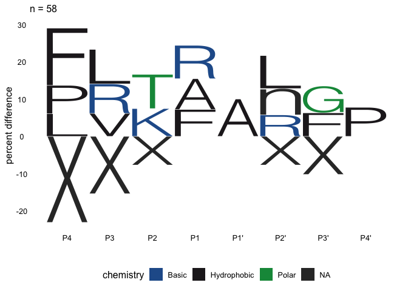

<!-- README.md is generated from README.Rmd. Please edit that file -->

# mspms

<!-- badges: start -->

[](https://github.com/baynec2/mspms/actions/workflows/R-CMD-check.yaml)
[](https://app.codecov.io/gh/baynec2/mspms?branch=main)
[](https://bioconductor.org/checkResults/release/bioc-LATEST/mspms)
<!-- badges: end -->

The goal of mspms is provide a concise code-base for the normalization
and data processing required to analyze data from the [Multiplex
Substrate Profiling by Mass Spectrometry (MSP-MS)
method](https://pubmed.ncbi.nlm.nih.gov/36948708/).

Additionally, we provide a [graphical user interface powered by shiny
apps](https://gonzalezlab.shinyapps.io/mspms_shiny/) that allows for a
user to utilize the method without requiring any R coding knowledge.

## Installation

You can install the development version of mspms from github.

``` r
devtools::install_github("baynec2/mspms",
                         ref = "develop")
```

## Quickstart

To generate a general report using your own data, run the following
code. It requires data that has been prepared for mspms data analysis by
a converter function, and a design matrix. For more information see
subsequent sections.

``` r
mspms::generate_report(
  prepared_data = mspms::peaks_prepared_data,
  design_matrix = mspms::design_matrix,
  outdir = "../Desktop/mspms_report"
)
```

The above command will generate a .html file containing a general mspms
analysis.

There is much more that can be done using the mspms package- see the
following sections for more information.

## Overview

There are 5 different types of functions in this package.

1.  Pre-processing data. These functions are focused on making mspms
    more generally useful to a wider audience outside of the very
    specific workflow traditionally used in the O’Donoghue lab. Allows
    for the use of other types of upstream proteomic data processing,
    different peptide libraries, etc.

2.  QC checks. These functions allow the user to conduct quality control
    checks

3.  Data processing/ normalization. These functions allow the user to
    normalize and process the MSP-MS data.

4.  Statistics. These methods allow the user to perform basic statistics
    on the normalized/processed data.

5.  Data visualization. These functions allow the user to visualize the
    data.

**Preprocessing data**.  
1. *prepare_peaks()*:Takes two exported files from PEAKS software,
combines them, and prepares for processing by the mspms R package. 2.
*prepare_pd()*: prepares exported files from proteome discoverer.  
3. *calculate_all_cleavages()*: Calculates all possible cleavages for
peptide library sequences.

**QC checks** 1. *qc_check()*: Conducts quality control checks on the
data. 2. *plot_qc_check()*: Plots the results of the qc_checks()
function. 3. *find_nd_peptides()*: Finds library peptides that were not
detected. 4. *plot_nd_peptides()*: Plots the results of the
find_nd_peptides() function.

**Data Processing/ Normalization**.  
1. *normalyze()*: Normalizes values.  
2. *handle_outliers()*: Looks for outliers across replicates. Removes
them.  
3. *impute()*: Imputes data for missing values (not including NAs
introduced by handle_outliers()).  
4. *join_with_library()*: Joins the normalized data with the peptide
library sequences.  
5. *add_cleavages()*: Figures out the locations of the detected
cleavages within the library of peptide sequences used. Is it cleaved at
the N or C terminus, or both? Uses *cterm_cleavage()* and
*nterm_cleavage()* to do this.  
6. *polish()*: combines the cleavage info into one column. Discards
peptides that were cleaved on both sides or not at all.  
7. *prepare_for_stats()*: Reshapes the data into a long format and
appends the data in the design matrix to make statistical testing easy
to perform.  
8 *mspms():* combines all of the above functions into one convenient
function.

**Calculations/ Statistics**.  
1. *mspms_log2fc()*: Calculates the log2 fold change across experimental
conditions relative to T0.  
2.*mspms_t_tests()*: Conducts T-tests to determine if there are any
peptides that are significantly different across experimental conditions
relative to time 0.  
3. *log2fc_t_test()*: Combines results from mspms_log2fc() and
mspms_t_tests() into one convenient tibble.  
4. *log2fct_condition()*: Calculates the log2 fold change and t tests
for the specified condition at a user specified time.  
5.*log2fct_time()*: Calculates the log2 fold change and t tests between
the specified times within a user specified time.  
6. *mspms_anova()*: Conducts ANOVA tests to determine if there are any
peptides that are significantly different across all time points.  
7. *count_cleavages_per_pos():* Counts the number of cleavages at each
position of the library. Useful for determining endoprotease vs
exoprotease activity. 8. *count_cleavages_per_pos()*: Counts the number
of cleavages at the position of the initial peptide detected peptides
were cleaved from.

**Icelogo calculations**

1.  *calc_AA_count_of_motif()*: calculates the count of each amino acid
    at each position in a vector of motifs.  
2.  *calc_AA_prop_of_motif()*: calculates the proportion of each amino
    acid at each position from the output of calc_AA_count_of_motif().  
3.  *calc_AA_motif_zscore()*: calculates z scores for each amino acid at
    each position in a vector of motifs.  
4.  *calc_sig_zscore()*: given a matrix of zscores, determines which are
    significant given a user defined p value.
5.  *calc_AA_percent_difference()*: calculates the percentage difference
    of
6.  *calc_AA_fold_change()*: calculates the fold change of a matrix
    containing the proportions of amino acids at each position relative
    to a background matrix.
7.  *prepare_sig_p_dif()*: prepares the data for plotting percent
    difference icelogos. Removes AAs at positions that are not
    significantly different.  
8.  *prepare_pd()*:prepares a matrix with significant amino acid percent
    differences by position for plotting.
9.  *prepare_fc()*: prepares the data for plotting fold change icelogos.
10. *prepare_icelogo_data()*: uses all the functions described above to
    prepare the data for plotting icelogos.
11. *extract_re()*: extracts regular expressions specifying amino acids
    above a defined threshold cutoff for each position of a cleavage
    motif from an icelogo matrix.

**Data Visualization**.  
1. *plot_heatmap()*: Conducts hierarchical clustering analysis and plots
an interactive heatmap to visualize overall patterns in the data.  
2. *plot_pca()*: PCA analysis to visualize the data in a 2D space.  
3. *plot_time_course()*: Plot peptides over time by condition.  
4. *plot_cleavages_per_pos()*: Plot the number of cleavages at each
position in the library.Useful for determining endoprotease vs
exoprotease activity. 5.*plot_icelogo()*: Plot an icelogo given an
icelogo matrix. 6.*plot_all_icelogos()*: generates icelogos representing
enriched sequences relative to time 0 for each conditions. This function
compares cleavage sequences corresponding to peptides that are
significant (p.adj \< 0.05 and log2 fold change \> 3) to a background of
all possible sequences present in the initial peptide library.

**Reports**. 1. *generate_report()*: Generates a simple analysis of the
mspms data that should be generically applicable to all mspms
experiments.

## Data Pre-processing

### Formating Peaks File Outputs.

Analysis downstream of data exported from PEAKS software is supported.

exported files are generated in the O’donoghue lab as follows:

1.  Create a New Project in PEAKS.  
2.  Select data to add to PEAKS project.  
3.  Add data, rename samples, set correct parameters. • Highlight all
    the added data.  
    • Select Create new sample for each file. • Select appropriate
    instrument and fragmentation method. • Set Enzyme to “None”. •
    Rename samples according to enzymes, time points, and replicates. •
    Can also ensure appropriate data is selected for these  
    • Select “Data Refinement” to continue.
4.  Data Refinement. • On the top right, select MSP-MS as the predefined
    parameters. • Parameters shown are what should be used for MSP-MS
    data analysis. • Select “Identification” to continue.
5.  Peptide Identification. • On the top right, select MSP-MS as the
    predefined parameters. • Parameters shown are what should be used
    for MSP-MS data analysis. • Identification -\> Select Database -\>
    TPD_237. • Identification -\> no PTMs. • Can remove the PTMs by
    highlighting them and selecting Remove  
6.  Label Free Quantification. • Make sure Label Free is selected. •
    Group samples -\> add quadruplicates of samples to new group.

``` r
library(dplyr)
#> 
#> Attaching package: 'dplyr'
#> The following objects are masked from 'package:stats':
#> 
#>     filter, lag
#> The following objects are masked from 'package:base':
#> 
#>     intersect, setdiff, setequal, union
```

``` r
library(mspms)

### Loading the files ###
lfq_filename <- "tests/testdata/protein-peptides-lfq.csv"
# file "protein-peptides.csv" exported from PEAKS identification
id_filename <- "tests/testdata/protein-peptides-id.csv"

# Prepare the data for normalyzer analysis
peaks_prepared_data <- prepare_peaks(lfq_filename, id_filename)
#> Rows: 1099 Columns: 46
#> ── Column specification ────────────────────────────────────────────────────────
#> Delimiter: ","
#> chr  (6): Protein Accession, Peptide, Used, Candidate, Sample Profile (Ratio...
#> dbl (40): Protein Group, Protein ID, Quality, Significance, Avg. ppm, Avg. A...
#> 
#> ℹ Use `spec()` to retrieve the full column specification for this data.
#> ℹ Specify the column types or set `show_col_types = FALSE` to quiet this message.
#> Rows: 1381 Columns: 66
#> ── Column specification ────────────────────────────────────────────────────────
#> Delimiter: ","
#> chr  (4): Protein Accession, Peptide, Unique, Source File
#> dbl (62): Protein Group, Protein ID, -10lgP, Mass, Length, ppm, m/z, z, RT, ...
#> 
#> ℹ Use `spec()` to retrieve the full column specification for this data.
#> ℹ Specify the column types or set `show_col_types = FALSE` to quiet this message.
```

### Formating Proteome Discoverer File Outputs.

We can prepare proteome discover files for analysis with mspms as
follows.

``` r
prepared_proteome_discoverer <-
  prepare_pd("tests/testdata/proteome_discoverer_output.xlsx")
#> New names:
#> • `Abundance: F12: Sample, 4, 60 min` -> `Abundance: F12: Sample, 4, 60
#>   min...15`
#> • `Abundance: F12: Sample, 4, 60 min` -> `Abundance: F12: Sample, 4, 60
#>   min...19`
```

### Calculating all cleavages

We might want to calculate all possible cleavages for the peptide
library sequences. This is useful for downstream analysis, especially
when we are looking at the specificity of the cleavage sites via
plot_cleavage_motif() as this requires a background of all possible
cleavages

We can do this by specifying the number of amino acids after the
cleavage site that we are interested in. First lets try 4, which is the
default.

``` r
all_peptide_sequences <- mspms::calculate_all_cleavages(
  mspms::peptide_library$library_real_sequence,
  n_AA_after_cleavage = 4
  )
head(all_peptide_sequences)
#> [1] "XXXLVATV" "XXXnLDKL" "XXXAVRAV" "XXXGIQST" "XXXSLNQA" "XXXFIVFI"
```

We could also try 5 AA after each cleavage site

``` r
all_peptide_sequences <- mspms::calculate_all_cleavages(
  mspms::peptide_library$library_real_sequence,
  n_AA_after_cleavage = 5
)
head(all_peptide_sequences)
#> [1] "XXXXLVATVY" "XXXXnLDKLn" "XXXXAVRAVE" "XXXXGIQSTY" "XXXXSLNQAY"
#> [6] "XXXXFIVFIL"
```

## QC Checks

In theory, all of the full length peptides present in the library should
be detected in the MSP-MS experiment. In practice, this isn’t the case
because some peptides fly worse than others.

The check_qc() function let’s us know what percentage of these full
length peptides are missing. This function also checks to see what

We can use it as follows:

``` r
qc_check <- mspms::qc_check(prepared_data = mspms::peaks_prepared_data,
                            peptide_library = mspms::peptide_library,
                            design_matrix = mspms::design_matrix)

head(qc_check)
#> # A tibble: 6 × 8
#>   sample      n_undigested_library_d…¹ n_library_detected perc_undigested_libr…²
#>   <chr>                          <int>              <int>                  <dbl>
#> 1 DMSO_T000_1                      207                217                   90.8
#> 2 DMSO_T000_2                      207                218                   90.8
#> 3 DMSO_T000_3                      207                217                   90.8
#> 4 DMSO_T000_4                      207                215                   90.8
#> 5 DMSO_T060_1                      205                219                   89.9
#> 6 DMSO_T060_2                      205                218                   89.9
#> # ℹ abbreviated names: ¹​n_undigested_library_detected,
#> #   ²​perc_undigested_library_detected
#> # ℹ 4 more variables: perc_library_detected <dbl>, group <chr>,
#> #   condition <chr>, time <dbl>
```

These results can then be visualized as follows using plot_qc_check()

First lets look at the percent of full length peptides in the library
detected

``` r
plot_qc_check(qc_check)[1]
#> [[1]]
```

<!-- -->

We can see here that most samples have more than 90% of the full length
peptides detected. We would expect to see ~90% of the peptides detected
at T0. Notably less than this would suggest that something funky
happened to the sample and it

all of these samples look reasonably good.

Now let’s look at all the percentage of peptides in the library
detected, including both full length and detected fragments.

``` r
plot_qc_check(qc_check)[2]
#> [[1]]
```

<!-- -->

Here we see that most samples have more than 90% of the peptides
detected. This is as would be expected with quality data, thus Ww can
consider these samples to have passed QC. Note that we see more peptides
here compared to the previous qc plot, since some of the digested
peptide fragments fly better than the parent peptides on the mass spec.

It may be helpful to know what peptides from the library were not
detected in a given experiment We can examine this as follows:

``` r
nd_peptides = mspms::find_nd_peptides(mspms::peaks_prepared_data,
                                      mspms::peptide_library,
                                      mspms::design_matrix)

head(nd_peptides)
#> # A tibble: 6 × 5
#>   sample      missing_peptide_id      type_missing       library_match_sequence
#>   <chr>       <chr>                   <chr>              <chr>                 
#> 1 DMSO_T000_1 TDP6|TDP6|generation1   completely_missing FIVFILWRTEHHAL        
#> 2 DMSO_T000_1 TDP24|TDP24|generation1 completely_missing LGWHALFRKYPILA        
#> 3 DMSO_T000_1 TDP55|TDP55|generation2 completely_missing SSGLLNIHFKFDWR        
#> 4 DMSO_T000_1 TDP66|TDP66|generation3 completely_missing PKDRWHTWLKIFNT        
#> 5 DMSO_T000_1 TDP130|TDP130|GenScript completely_missing ERWHDINLSVSLQI        
#> 6 DMSO_T000_1 TDP133|TDP133|GenScript completely_missing EQREVYTQIWILTV        
#> # ℹ 1 more variable: library_real_sequence <chr>
```

we can then visualize as follows using the plot_nd_peptides() function.

``` r
plot_nd_peptides(nd_peptides)
```

<!-- --> Here we can
see that some of the full length peptides are not detected in 100% of
samples. Additionally, some of these library peptides are not detected,
even when considering possible fragment peptides.

## Data Normalization/ Processing

### Loading design matrix

Before we normalyze data, we need to know what samples are in what
groups. We can do that by defining a design matrix.

``` r
design_matrix <- readr::read_csv("tests/testdata/design_matrix.csv")
#> Rows: 24 Columns: 4
#> ── Column specification ────────────────────────────────────────────────────────
#> Delimiter: ","
#> chr (3): sample, group, condition
#> dbl (1): time
#> 
#> ℹ Use `spec()` to retrieve the full column specification for this data.
#> ℹ Specify the column types or set `show_col_types = FALSE` to quiet this message.
```

``` r

head(design_matrix)
#> # A tibble: 6 × 4
#>   sample      group    condition  time
#>   <chr>       <chr>    <chr>     <dbl>
#> 1 DMSO_T000_1 DMSO_T0  DMSO          0
#> 2 DMSO_T000_2 DMSO_T0  DMSO          0
#> 3 DMSO_T000_3 DMSO_T0  DMSO          0
#> 4 DMSO_T000_4 DMSO_T0  DMSO          0
#> 5 DMSO_T060_1 DMSO_T60 DMSO         60
#> 6 DMSO_T060_2 DMSO_T60 DMSO         60
```

### Normalyzing data

mspms uses the NormalyzerDE package to do normalization under the hood.

We can normalyze the data as follows:

``` r
normalyzed_data <- normalyze(peaks_prepared_data, design_matrix)
#> You are running version 1.19.7 of NormalyzerDE
#> [Step 1/5] Load data and verify input
#> Input data checked. All fields are valid.
#> Sample check: More than one sample group found
#> Sample replication check: All samples have replicates
#> RT annotation column found (2)
#> [Step 1/5] Input verified, job directory prepared at:./2024-07-25_mspms_normalyze_output
#> [Step 2/5] Performing normalizations
#> [Step 2/5] Done!
#> [Step 3/5] Generating evaluation measures...
#> [Step 3/5] Done!
#> [Step 4/5] Writing matrices to file
#> [Step 4/5] Matrices successfully written
#> [Step 5/5] Generating plots...
#> [Step 5/5] Plots successfully generated
#> All done! Results are stored in: ./2024-07-25_mspms_normalyze_output, processing time was 0.3 minutes
#> Rows: 820 Columns: 27
#> ── Column specification ────────────────────────────────────────────────────────
#> Delimiter: "\t"
#> chr  (2): Peptide, Protein Accession
#> dbl (25): RT, DMSO_T000_1, DMSO_T000_2, DMSO_T000_3, DMSO_T000_4, DMSO_T060_...
#> 
#> ℹ Use `spec()` to retrieve the full column specification for this data.
#> ℹ Specify the column types or set `show_col_types = FALSE` to quiet this message.
```

### Handling Outliers

Here we use a Dixon test from the outliers package to detect outliers
from each of our replicates. We need to know what samples are part of
which groups, so we need to specify the design matrix here too. Make
sure that the column header names are “sample” and “group” just like
before.

``` r
design_matrix <- readr::read_csv("tests/testdata/design_matrix.csv")
#> Rows: 24 Columns: 4
#> ── Column specification ────────────────────────────────────────────────────────
#> Delimiter: ","
#> chr (3): sample, group, condition
#> dbl (1): time
#> 
#> ℹ Use `spec()` to retrieve the full column specification for this data.
#> ℹ Specify the column types or set `show_col_types = FALSE` to quiet this message.
```

``` r
outliers <- handle_outliers(normalyzed_data, design_matrix)
```

### Imputation of data

We have a lot of missing, or 0 values. For these, we need to impute them
so we can do downstream statistics.

``` r
imputed <- mspms::impute(outliers)
```

### Joining with Library

Next we need to join everything with the sequences of the peptide
library.

``` r
joined_with_library <- mspms::join_with_library(imputed)
```

### Calcuating cleavages.

Next, we need to determine where the peptide sequences are cleaved.

We check both the N and C terminus.

Sequences are presented as the user specified number of amino acids on
both sides of a cleavage. The default is 4, but there is interest in
looking at motifs that are farther away from the cut site. Note that X
indicates that there was nothing at that position because it is over the
end.

``` r
cleavage_added_data <- mspms::add_cleavages(joined_with_library, n_residues = 4)

head(cleavage_added_data)
#> # A tibble: 6 × 32
#>   Peptide      library_reference_id library_match_sequence library_real_sequence
#>   <chr>        <chr>                <chr>                  <chr>                
#> 1 LVATVYEFGHI… TDP1|TDP1|generatio… LVATVYEFGHIDHL         LVATVYEFGHIDHn       
#> 2 L_VATVYEFGH… TDP1|TDP1|generatio… LVATVYEFGHIDHL         LVATVYEFGHIDHn       
#> 3 T_VYEFGHIDHL TDP1|TDP1|generatio… LVATVYEFGHIDHL         LVATVYEFGHIDHn       
#> 4 A_TVYEFGHID… TDP1|TDP1|generatio… LVATVYEFGHIDHL         LVATVYEFGHIDHn       
#> 5 LVATVYEFGHI… TDP1|TDP1|generatio… LVATVYEFGHIDHL         LVATVYEFGHIDHn       
#> 6 LLDKLLNWPQR… TDP2|TDP2|generatio… LLDKLLNWPQRRGL         nLDKLnNWPQRRGn       
#> # ℹ 28 more variables: nterm <chr>, nterm_cleavage_pos <dbl>, cterm <chr>,
#> #   cterm_cleavage_pos <dbl>, DMSO_T060_1 <dbl>, DMSO_T060_2 <dbl>,
#> #   DMSO_T060_3 <dbl>, DMSO_T060_4 <dbl>, DMSO_T240_1 <dbl>, DMSO_T240_2 <dbl>,
#> #   DMSO_T240_3 <dbl>, DMSO_T240_4 <dbl>, MZB_T240_2 <dbl>, MZB_T240_3 <dbl>,
#> #   MZB_T240_1 <dbl>, MZB_T240_4 <dbl>, DMSO_T000_1 <dbl>, DMSO_T000_2 <dbl>,
#> #   DMSO_T000_3 <dbl>, DMSO_T000_4 <dbl>, MZB_T000_1 <dbl>, MZB_T000_2 <dbl>,
#> #   MZB_T000_3 <dbl>, MZB_T000_4 <dbl>, MZB_T060_1 <dbl>, MZB_T060_2 <dbl>, …
```

### Adding metadata back

We need to add information about our samples back to perform downstream
statistics on the data. We accomplish this with the prepare for stats
file.

``` r
prepared_for_stats <- mspms::prepare_for_stats(cleavage_added_data,
                                               design_matrix)
```

### Polishing

This function polishes the data by combining the cterm and nterm
cleavage information into one column while removing any rows that don’t
have any cleavage information or have cleavage information on the cterm
and nterm.

``` r
polished_data <- mspms::polish(cleavage_added_data)
```

### Complete workflow

There are a lot of steps to get to the final normalized data we listed
above. We have combined all of these steps into one function, mspms()
for convenience. This offers a nice balance between allowing the user
the option to use individual steps and providing a quick way to get to
the final data.

``` r
mspms_data <- mspms::mspms(peaks_prepared_data, design_matrix)
#> You are running version 1.19.7 of NormalyzerDE
#> [Step 1/5] Load data and verify input
#> Input data checked. All fields are valid.
#> Sample check: More than one sample group found
#> Sample replication check: All samples have replicates
#> RT annotation column found (2)
#> [Step 1/5] Input verified, job directory prepared at:./2024-07-25_mspms_normalyze_output
#> [Step 2/5] Performing normalizations
#> [Step 2/5] Done!
#> [Step 3/5] Generating evaluation measures...
#> [Step 3/5] Done!
#> [Step 4/5] Writing matrices to file
#> [Step 4/5] Matrices successfully written
#> [Step 5/5] Generating plots...
#> [Step 5/5] Plots successfully generated
#> All done! Results are stored in: ./2024-07-25_mspms_normalyze_output, processing time was 0.2 minutes
#> Rows: 820 Columns: 27
#> ── Column specification ────────────────────────────────────────────────────────
#> Delimiter: "\t"
#> chr  (2): Peptide, Protein Accession
#> dbl (25): RT, DMSO_T000_1, DMSO_T000_2, DMSO_T000_3, DMSO_T000_4, DMSO_T060_...
#> 
#> ℹ Use `spec()` to retrieve the full column specification for this data.
#> ℹ Specify the column types or set `show_col_types = FALSE` to quiet this message.
```

## Statistics

mspms provides a number of convenience functions to conduct statistics
on the data.

First, we need to prepare the data for stats. This involves reshaping
the data into the long format so it is easy to conduct statistics on and
then appending the data in the design matrix that allows us to determine
what sample contains what conditions/time and conduct the appropriate
statistics.

Now we can conduct the statistics:

### T tests

T tests are performed within each condition and compared to time 0.

For example, for an experiment where there are two conditions, DMSO and
MZB as well as 3 time points, 0, 1, and 2, the t tests would be as
follows:

- DMSO.TO vs DMSO.T0.

- DMSO.T0 vs DMSO.T1.

- DMSO.T0 vs DMSO.T2.

- MZB.T0 vs MZB.T0.

- MZB.T0 vs MZB.T1.

- MZB.T0 vs MZB.T2.

``` r
# Perform T test
t_test_stats <- mspms::mspms_t_tests(mspms_data)
```

### log2FC

We can also calculate the log 2 fold change. The comparisons here are
the same as for the T tests.

``` r
# calculate log2fc
log2fc <- mspms::mspms_log2fc(mspms_data)

head(log2fc)
#> # A tibble: 6 × 7
#>   condition Peptide        control_mean  time reference_mean comparison   log2fc
#>   <chr>     <chr>                 <dbl> <dbl>          <dbl> <chr>         <dbl>
#> 1 DMSO      AAPYHKLETNITSG   231287600.     0     231287600. DMSO.T0/DMS…  0    
#> 2 DMSO      AAPYHKLETNITSG   231287600.    60     385450615. DMSO.T60/DM…  0.737
#> 3 DMSO      AAPYHKLETNITSG   231287600.   240     278208500. DMSO.T240/D…  0.266
#> 4 DMSO      ADARKYWNVHGTHQ   101113749.     0     101113749. DMSO.T0/DMS…  0    
#> 5 DMSO      ADARKYWNVHGTHQ   101113749.    60     166235600. DMSO.T60/DM…  0.717
#> 6 DMSO      ADARKYWNVHGTHQ   101113749.   240     119066521. DMSO.T240/D…  0.236
```

### log2fc_t_tests.

Oftentimes (such as when you want to make volcano plots) it is most
useful to look at the log2fc and the t test statistics at the same time.

``` r
log2fc_t_test <- mspms::log2fc_t_test(mspms_data)

head(log2fc_t_test)
#> # A tibble: 6 × 19
#>   Peptide       control_mean time  reference_mean comparison log2fc cleavage_seq
#>   <chr>                <dbl> <chr>          <dbl> <chr>       <dbl> <chr>       
#> 1 AAPYHKLETNIT…   231287600. 60        385450615. DMSO.T60/…  0.737 <NA>        
#> 2 AAPYHKLETNIT…   231287600. 240       278208500. DMSO.T240…  0.266 <NA>        
#> 3 ADARKYWNVHGT…   101113749. 60        166235600. DMSO.T60/…  0.717 <NA>        
#> 4 ADARKYWNVHGT…   101113749. 240       119066521. DMSO.T240…  0.236 <NA>        
#> 5 ADIVANFTGHGY…   264432528. 60        459550722. DMSO.T60/…  0.797 <NA>        
#> 6 ADIVANFTGHGY…   264432528. 240       314130902. DMSO.T240…  0.248 <NA>        
#> # ℹ 12 more variables: cleavage_pos <dbl>, .y. <chr>, group1 <chr>,
#> #   group2 <fct>, n1 <int>, n2 <int>, statistic <dbl>, df <dbl>, p <dbl>,
#> #   p.adj <dbl>, p.adj.signif <chr>, condition <chr>
```

### log2fct_condition

You may wish to compare two conditions at a specific time point. This
function allows this

``` r
condition_t = mspms::log2fct_condition(mspms_data,
                                       ref_condition = "DMSO",
                                       comparison_condition = "MZB",
                                       at_time = 60)


head(condition_t)
#> # A tibble: 6 × 16
#>   Peptide         comparison_mean reference_mean log2fc comparison  cleavage_seq
#>   <chr>                     <dbl>          <dbl>  <dbl> <chr>       <chr>       
#> 1 AAPYHKLETNITSG       258249187.     385450615. -0.578 MZB/DMSO a… <NA>        
#> 2 ADARKYWNVHGTHQ       101569889.     166235600. -0.711 MZB/DMSO a… <NA>        
#> 3 ADIVANFTGHGYHQ       287965814.     459550722. -0.674 MZB/DMSO a… <NA>        
#> 4 AETSIKVFLPYYGH       192650900.     276229845. -0.520 MZB/DMSO a… <NA>        
#> 5 AETSIKVFLPYYG_H          41440.        186881. -2.17  MZB/DMSO a… PYYGHXXX    
#> 6 AETSIKVFL_P              73014.        293626. -2.01  MZB/DMSO a… KVFnPYYG    
#> # ℹ 10 more variables: cleavage_pos <dbl>, .y. <chr>, group1 <chr>,
#> #   group2 <chr>, n1 <int>, n2 <int>, statistic <dbl>, df <dbl>, p <dbl>,
#> #   p.adj <dbl>
```

### log2fct_time

You may wish to compare two time points within a specific condition.
This function allows

``` r
time_t = mspms::log2fct_time(mspms_data,
                             within_condition = "DMSO",
                             ref_time = 0,
                             comparison_time = 60)

head(time_t)
#> # A tibble: 6 × 15
#>   Peptide    comparison_mean reference_mean log2fc comparison cleavage_seq .y.  
#>   <chr>                <dbl>          <dbl>  <dbl> <chr>      <chr>        <chr>
#> 1 AAPYHKLET…      385450615.     231287600.  0.737 60/0 with… <NA>         value
#> 2 ADARKYWNV…      166235600.     101113749.  0.717 60/0 with… <NA>         value
#> 3 ADIVANFTG…      459550722.     264432528.  0.797 60/0 with… <NA>         value
#> 4 AETSIKVFL…      276229845.     213533188.  0.371 60/0 with… <NA>         value
#> 5 AETSIKVFL…         186881.         89862.  1.06  60/0 with… PYYGHXXX     value
#> 6 AETSIKVFL…         293626.        144989.  1.02  60/0 with… KVFnPYYG     value
#> # ℹ 8 more variables: group1 <chr>, group2 <chr>, n1 <int>, n2 <int>,
#> #   statistic <dbl>, df <dbl>, p <dbl>, p.adj <dbl>
```

### ANOVA

We also might want to perform an anova. Here, we have it set up to show
the effect of time within each condition.

For example, for an experiment where there are two conditions, DMSO and
MZB as well as 3 time points, 0, 1, and 2, the anova would statistics
for the effect of time for each peptide within DMSO or MZB.

``` r
# Doing ANOVA
anova_stats <- mspms::mspms_anova(mspms_data)
#> Warning: There were 169 warnings in `mutate()`.
#> The first warning was:
#> ℹ In argument: `data = map(.data$data, .f, ...)`.
#> Caused by warning:
#> ! NA detected in rows: 6,12.
#> Removing this rows before the analysis.
#> ℹ Run `dplyr::last_dplyr_warnings()` to see the 168 remaining warnings.
```

``` r

head(anova_stats)
#> # A tibble: 6 × 11
#>   Peptide  cleavage_pos condition Effect   DFn   DFd     F     p `p<.05`     ges
#>   <chr>           <dbl> <chr>     <chr>  <dbl> <dbl> <dbl> <dbl> <chr>     <dbl>
#> 1 AAPYHKL…           NA DMSO      time       1    10 0.003 0.956 ""      3.24e-4
#> 2 ADARKYW…           NA DMSO      time       1    10 0.001 0.975 ""      1   e-4
#> 3 ADIVANF…           NA DMSO      time       1    10 0.009 0.928 ""      8.7 e-4
#> 4 AETSIKV…           NA DMSO      time       1    10 1.06  0.328 ""      9.5 e-2
#> 5 AETSIKV…           13 DMSO      time       1    10 0.351 0.567 ""      3.4 e-2
#> 6 AETSIKV…            9 DMSO      time       1    10 3.31  0.099 ""      2.49e-1
#> # ℹ 1 more variable: p.adj <dbl>
```

## Common Data Visualizations

We also provide some functions that make common data visualizations
easier.

### volcano plots

``` r
volcano_plot <- mspms::plot_volcano(log2fc_t_test)

volcano_plot
```

<!-- -->

### Plotting sequence specificity motif

Here use an approach similar to what is implemented in ICELOGO to
visualize the sequence specificity of the cleavage sites. This was used
as reference to build the code:
<https://iomics.ugent.be/icelogoserver/resources/manual.pdf>.

Below we can see this applied to see what cleavage sequences are
enriched among the peptides significantly different between time 0 and
time 60 within DMSO.

``` r
cleavage_seqs <- time_t %>%
  dplyr::filter(log2fc > 3, p.adj <= 0.05) %>%
  dplyr::pull(cleavage_seq)

background_universe <- mspms::all_possible_8mers_from_228_library


mspms::plot_icelogo(cleavage_seqs, background_universe)
#> Scale for x is already present.
#> Adding another scale for x, which will replace the existing scale.
```

<!-- -->

We could also look at the fold change instead of the percent difference.

``` r
mspms::plot_icelogo(cleavage_seqs, background_universe, type = "fold_change")
#> Scale for x is already present.
#> Adding another scale for x, which will replace the existing scale.
```

<!-- -->

We also provide a convenience function for looking at all icelogos
relative to time 0 within the experiment.

This function includes cleavages that were significant at any time point
once in the experimental set of the ICELOGO. Below we show this applied
to create percent difference and fold change icelogos.

``` r
plot_all_icelogos(mspms_data)
#> Scale for x is already present.
#> Adding another scale for x, which will replace the existing scale.
```

<!-- -->

``` r

plot_all_icelogos(mspms_data, type = "fold_change")
#> Scale for x is already present.
#> Adding another scale for x, which will replace the existing scale.
```

<!-- -->

### Extracting regular expressions from icelogos

It might be useful for the user to extract the information contained in
the Icelogo and use it to filter their data for peptides that are
predicted to be well cleaved, or not cleaved according to the icelogo
plot.

For example, we can get the amino acids that are enriched at each
position of the icelogo using the code below.

``` r

# Getting data for Icelog 
cleavage_seqs <- time_t %>%
  dplyr::filter(log2fc > 3, p.adj <= 0.05) %>%
  dplyr::pull(cleavage_seq)

background_universe <- mspms::all_possible_8mers_from_228_library

# Plotting icelogo
mspms::plot_icelogo(cleavage_seqs, background_universe)
#> Scale for x is already present.
#> Adding another scale for x, which will replace the existing scale.
```

<!-- -->

``` r

# corresponding icelogo data to the plot
icelogo_matrix = mspms::prepare_icelogo_data(cleavage_seqs, background_universe)

# Extracting regular expressions
RE_pos = mspms::extract_re(icelogo_matrix)

RE_pos
#> [1] "(F|L|P)(L|R|V)(K|T)(A|F|R)(A)(L|n|R)(F|G)(P)"
```

We can also do this for amino acids that are negatively enriched.

``` r
RE_neg = mspms::extract_re(icelogo_matrix,type = "negative")

RE_neg
#> [1] "(X)(X)(X)(.)(.)(X)(X)(.)"
```

Once we have these regular expressions, we can use it to filter our data
as follows:

``` r
pos_enriched = mspms_data %>% 
  dplyr::filter(grepl(RE_pos, cleavage_seq))
```

In this case, none of the peptides in the original data set match all
the rules in our library (peptide library does not contain all possible
combinations, so none of the peptides was a match to the combination of
rules at each position)

We could then filter to only include peptides that are greater than a
certain threshold percent difference. We can then visualize these
results easily with the plot_time_course function described further
below. Here we will only consider AAs with a percent difference greater
than 10 at each position.

``` r
# Extracting regular expressions 
RE_pos = mspms::extract_re(icelogo_matrix,threshold = 10)

RE_pos
#> [1] "(F)(.)(.)(.)(A)(.)(.)(.)"
```

``` r

# Filtering data for peptides that have cleavage sequences matching regular 
# expressions
f = mspms_data %>% 
  dplyr::filter(grepl(RE_pos, cleavage_seq))

#visualizing these peptides that match over time.
plot_time_course(f)
```

<!-- -->

Here we see that these peptides were cleaved over time in DMSO, as would
be expected based on the icelogo plot.

### PCA.

We can generate a PCA plot to visualize the data. Here, the colors show
the different time points while the shape shows the different
conditions.

``` r
mspms::plot_pca(mspms_data)
```

<!-- -->

### Hierchical clustering

We can also generate an interactive heatmap with the hierarchical
clustering results.

The format of this readme does not allow for interactivity, so a static
picture of the output is shown instead.

``` r
mspms::plot_heatmap(mspms_data)
```


### Ploting time course.

We also provide a function for plotting the mean intensity and standard
deviation over time for each peptide in the data set by conditions.
Facets show peptide, color shows the condition.

This can be used in combination with the ANOVA function. Below, we will
use anova to calculate the peptides where we see an effect of time (in
the DMSO group), and then plot these.

``` r

top10sig <- anova_stats %>%
  dplyr::arrange(p.adj) %>%
  dplyr::pull(Peptide) %>%
  head(10)


p1 <- mspms_data %>%
  dplyr::filter(Peptide %in% top10sig) %>%
  mspms::plot_time_course()

p1
```

<!-- -->

## Calculating the number of cleavages at each position in the library

We can also calculate the number of cleavages at each position of the
library. Here we will do this for peptides significantly different
relative to time 0 for DMSO and MZB.

``` r
# Performing T tests
t_tests = log2fc_t_test(mspms_data) %>% 
  dplyr::filter(p.adj < 0.05,
                log2fc > 3)

count = mspms::count_cleavages_per_pos(t_tests)

p1 = mspms:::plot_cleavages_per_pos(count)

p1
```

<!-- -->
