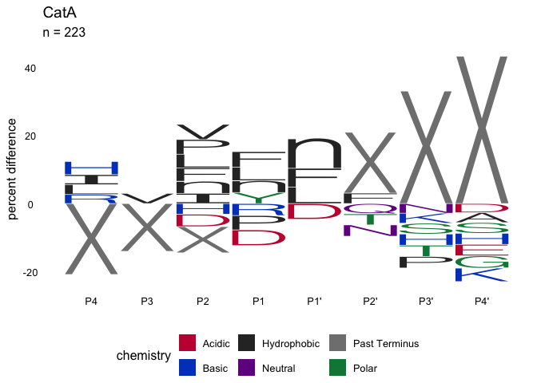

<!-- README.md is generated from README.Rmd. Please edit that file -->


# mspms

<!-- badges: start -->

[](https://github.com/baynec2/mspms/actions/workflows/R-CMD-check.yaml)
[](https://app.codecov.io/gh/baynec2/mspms?branch=main)

<!-- badges: end -->

## Introduction

The goal of mspms is provide a R Package that can be used to easily and
reproducibly analyze data resulting from the [Multiplex Substrate
Profiling by Mass Spectrometry (MSP-MS)
method](https://pubmed.ncbi.nlm.nih.gov/36948708/).

Additionally, we provide a [graphical user interface powered by shiny
apps](https://gonzalezlab.shinyapps.io/mspms_shiny/) that allows for a
user to utilize the method without requiring any R coding knowledge.

Multiplex Substrate Profiling by Mass Spectrometry
[(MSP-MS)](https://pubmed.ncbi.nlm.nih.gov/36948708/) is a powerful
method used to determine the substrate specificity of proteases. This
method is of interest for groups interested in the study of proteases
and their role as regulators of biological pathways, whether applied to
the study of disease states, the development of diagnostic and
prognostic tests, generation of tool compounds, or rational design of
protease targeting therapeutics. Analysis of the MS based data produced
by MSP-MS is a multi-step process involving detection and quantification
of peptides, imputation, normalization, cleavage sequence
identification, statistics, and data visualizations. This process can be
challenging, especially for scientists with limited programming
experience. To overcome these issues, we developed the mspms R package
to facilitate the analysis of MSP-MS data utilizing good software/data
analysis practices.

mspms differs from existing proteomics packages that are available in
the Bioconductor project in that it is specifically designed to analyze
MSP-MS data. This involves unique preprocessing steps and data
visualizations tailored to this specific assay

In order to do so, mspms uses several excellent packages from the
Bioconductor project to provide a framework to easily and reproducibly
analyze MSP-MS data. These include:

- QFeatures: management and processing of peptide quantitative features
  and sample metadata.

- MsCoreUtils: log2 transformation, imputation (QRILC), and
  normalization (center.median).

Some excellent non-Bioconductor packages are also utilized.

- ggplot2: data visualizations

- heatmaply: interactive heatmaps

- rstatix: conduct statistics

- ggseqlogo: iceLogo motif visualization.

- downloadthis: gives users the ability to download data from standard
  .html report generated by mspms::generate_report().

Lastly, mspms takes advantage of iceLogos ([Colaert, N. et al. Nature
Methods 6, 786-787 (2009)](http://www.ncbi.nlm.nih.gov/pubmed/19876014))
to visualize over-represented amino acid motifs relative to a background
set by implementing components of the Java software in R.

## Installation

You can install the development version from github.

``` r
devtools::install_github("baynec2/mspms")
```

## Quickstart

To generate a general report using your own data, run the following
code. It requires data that has been prepared for mspms data analysis by
a converter function. For more information see subsequent sections.

``` r
mspms::generate_report(
    prepared_data = mspms::peaks_prepared_data,
    outdir = "../Desktop/mspms_report"
)
```

The above command will generate a .html file containing a generic mspms
analysis.

There is much more that can be done using the mspms package- see the
following sections for more information.

## Overview

Functions in this package are logically divided into 4 broad types of
functions.

1.  Pre-processing data. These functions are focused on getting all of
    the data necessary for a mspms analysis together and in a consistent
    format.

2.  Data processing. These functions allow the user to process the
    proteomics data (imputation, normalization, etc).

3.  Statistics. These methods allow the user to perform basic statistics
    on the normalized/processed data.

4.  Data visualization. These functions allow the user to visualize the
    data.

**Note that only a subset of functions are exported to the user.**
Helper functions can be found in the \_helper_functions.R files.

## Pre-processing data

Pre-processing data here refers to standardizing the data exported from
different software solutions for analyzing mass spectrometry-based
proteomics and adding useful information specific to the MSP-MS assay.

Specifically, the data from the file exported from the upstream software
is parsed to contain the **peptide** (detected peptide sequence,
cleavages are represented as “\_”), **library_id** (name of the peptide
in the peptide library each detected peptide maps to), and intensities
for each sample.

Information about each peptide relative to the peptide it was derived
from is then added. This includes the **cleavage_seq** (the motif the
peptide a user specified n residues up and down from the cleavage
event), **cleavage_pos** (position of the peptide library the cleavage
product was cleaved at ), **peptide_type** (whether the detected peptide
is a cleavage product of the peptide library, or a full length member of
the peptide library).

All of the information is then loaded as a QFeatures object along with
colData (metadata about each sample) where it is stored as a
SummarizedExperiment object named “peptides”.

#### A note on colData

As briefly described above, the colData contains metadata describing the
samples you are trying to analyze.

It is very important that this contains at least the following columns
-“quantCols”,“group”,“condition”,and “time”.

The quantCols field contains the name of each sample. These names must
match whatever the samples are named in the files exported from the
upstream proteomics software.

The group field contains text specifying what group each sample belongs
to. All replicate samples should have the same group name

The condition field contains the experimental conditions that vary in
your MSP-MS experiment (this depends on the experimental question, could
be type of protease, the type of inhibitor, etc)

The time field contains the duration of incubation of your protease of
interest with the peptide library for each sample.

An example of a valid colData file is shown below.

``` r
colData <- readr::read_csv(system.file("extdata/colData.csv",
    package = "mspms"
))
#> Rows: 42 Columns: 4
#> ── Column specification ────────────────────────────────────────────────────────
#> Delimiter: ","
#> chr (3): quantCols, group, condition
#> dbl (1): time
#> 
#> ℹ Use `spec()` to retrieve the full column specification for this data.
#> ℹ Specify the column types or set `show_col_types = FALSE` to quiet this message.

head(colData)
#> # A tibble: 6 × 4
#>   quantCols   group     condition  time
#>   <chr>       <chr>     <chr>     <dbl>
#> 1 CatA_0000_1 CatA_0000 CatA          0
#> 2 CatA_0000_2 CatA_0000 CatA          0
#> 3 CatA_0000_3 CatA_0000 CatA          0
#> 4 CatA_0000_4 CatA_0000 CatA          0
#> 5 CatA_0030_1 CatA_0030 CatA         30
#> 6 CatA_0030_2 CatA_0030 CatA         30
```

#### PEAKS

Analysis using a .csv exported from [PEAKS
software](https://www.bioinfor.com/peaks-studio/) is supported.

an exported .csv file can be generated from PEAKS as follows:

1.  Create a New Project in PEAKS.  
2.  Select data to add to PEAKS project.  
3.  Add data, rename samples, set correct parameters. • Highlight all
    the added data.  
    • Select Create new sample for each file.  
    • Select appropriate instrument and fragmentation method.  
    • Set Enzyme to “None”.  
    • Rename samples according to enzymes, time points, and
    replicates.  
    • Can also ensure appropriate data is selected for these.  
    • Select “Data Refinement” to continue.  
4.  Data Refinement.  
    • On the top right, select MSP-MS as the predefined parameters.  
    • Parameters shown are what should be used for MSP-MS data
    analysis.  
    • Select “Identification” to continue.  
5.  Peptide Identification.  
    • On the top right, select MSP-MS as the predefined parameters.  
    • Parameters shown are what should be used for MSP-MS data
    analysis.  
    • Identification -\> Select Database -\> TPD_237.  
    • Identification -\> no PTMs.  
    • Can remove the PTMs by highlighting them and selecting Remove  
6.  Label Free Quantification.  
    • Make sure Label Free is selected.  
    • Group samples -\> add quadruplicates of samples to new group.

``` r
library(dplyr)
#> 
#> Attaching package: 'dplyr'
#> The following objects are masked from 'package:stats':
#> 
#>     filter, lag
#> The following objects are masked from 'package:base':
#> 
#>     intersect, setdiff, setequal, union
library(mspms)
#> 
#> Attaching package: 'mspms'
#> The following object is masked _by_ '.GlobalEnv':
#> 
#>     colData

# File path of peaks lfq file
lfq_filepath <- system.file("extdata/peaks_protein-peptides-lfq.csv",
    package = "mspms"
)

colData_filepath <- system.file("extdata/colData.csv", package = "mspms")

# Prepare the data
peaks_prepared_data <- mspms::prepare_peaks(lfq_filepath,
    colData_filepath,
    0.3,
    n_residues = 4
)
#> Rows: 2444 Columns: 70
#> ── Column specification ────────────────────────────────────────────────────────
#> Delimiter: ","
#> chr  (6): Protein Accession, Peptide, Used, Candidate, Sample Profile (Ratio...
#> dbl (63): Protein Group, Protein ID, Quality, Significance, Avg. ppm, Avg. A...
#> lgl  (1): PTM
#> 
#> ℹ Use `spec()` to retrieve the full column specification for this data.
#> ℹ Specify the column types or set `show_col_types = FALSE` to quiet this message.
#> 841 peptides were removed because they had a quality score < 0.3 (34%)
#> 
#> Rows: 42 Columns: 4
#> ── Column specification ────────────────────────────────────────────────────────
#> Delimiter: ","
#> chr (3): quantCols, group, condition
#> dbl (1): time
#> 
#> ℹ Use `spec()` to retrieve the full column specification for this data.
#> ℹ Specify the column types or set `show_col_types = FALSE` to quiet this message.
#> Checking arguments.
#> 
#> Loading data as a 'SummarizedExperiment' object.
#> 
#> Formatting sample annotations (colData).
#> 
#> Formatting data as a 'QFeatures' object.

peaks_prepared_data
#> An instance of class QFeatures containing 1 assays:
#>  [1] peptides: SummarizedExperiment with 2071 rows and 42 columns
```

#### Fragpipe

Data exported from [Fragpipe](https://github.com/Nesvilab/FragPipe) as a
.tsv file is supported.

To generate this file, run a [LFQ Fragpipe
workflow](https://fragpipe.nesvilab.org/docs/tutorial_lfq.html) using
your desired parameters (we recommend using match between runs).

You will find a file named “combined_peptide.tsv” in the output folder
from Fragpipe.

This can be loaded into mspms as follows:

``` r
combined_peptide_filepath <- system.file("extdata/fragpipe_combined_peptide.tsv",
                                        package = "mspms")

colData_filepath <- system.file("extdata/colData.csv", package = "mspms")


fragpipe_prepared_data <- prepare_fragpipe(
    combined_peptide_filepath,
    colData_filepath
)
#> Rows: 1911 Columns: 182
#> ── Column specification ────────────────────────────────────────────────────────
#> Delimiter: "\t"
#> chr  (50): Peptide Sequence, Prev AA, Next AA, Protein, Protein ID, Entry Na...
#> dbl (129): Start, End, Peptide Length, CatA_0000_1 Spectral Count, CatA_0000...
#> num   (1): Charges
#> lgl   (2): Mapped Genes, Mapped Proteins
#> 
#> ℹ Use `spec()` to retrieve the full column specification for this data.
#> ℹ Specify the column types or set `show_col_types = FALSE` to quiet this message.
#> Rows: 42 Columns: 4
#> ── Column specification ────────────────────────────────────────────────────────
#> Delimiter: ","
#> chr (3): quantCols, group, condition
#> dbl (1): time
#> 
#> ℹ Use `spec()` to retrieve the full column specification for this data.
#> ℹ Specify the column types or set `show_col_types = FALSE` to quiet this message.
#> Checking arguments.
#> 
#> Loading data as a 'SummarizedExperiment' object.
#> 
#> Formatting sample annotations (colData).
#> 
#> Formatting data as a 'QFeatures' object.

fragpipe_prepared_data
#> An instance of class QFeatures containing 1 assays:
#>  [1] peptides: SummarizedExperiment with 1694 rows and 42 columns
```

#### Proteome Discoverer

Analysis of a PeptideGroups.txt file exported from [proteome
discoverer](https://www.thermofisher.com/us/en/home/industrial/mass-spectrometry/liquid-chromatography-mass-spectrometry-lc-ms/lc-ms-software/multi-omics-data-analysis/proteome-discoverer-software.html)
is supported.

To generate this .txt file: 1. Ensure that non-normalized/ non-scaled
abundances are included in your PeptideGroup table.  
2. File \> export \> To Text (tab delimited) \> Items to be exported -
check the Peptide Groups box \> Export.

Note that the fileIDs of each sample in proteome discoverer (By default
F1 - Fn) must match the quantCols in colData.

``` r
peptide_groups_filepath <- system.file(
    "extdata/proteome_discoverer_PeptideGroups.txt",
    package = "mspms"
)

colData_filepath <- system.file("extdata/proteome_discover_colData.csv",
    package = "mspms"
)

prepared_pd_data <- prepare_pd(peptide_groups_filepath, colData_filepath)
#> Rows: 1207 Columns: 189
#> ── Column specification ────────────────────────────────────────────────────────
#> Delimiter: "\t"
#> chr  (48): Confidence, Annotated Sequence, Master Protein Accessions, Positi...
#> dbl (138): Peptide Groups Peptide Group ID, Qvality PEP, Qvality q-value, # ...
#> lgl   (3): Checked, Modifications, Modifications in Master Proteins
#> 
#> ℹ Use `spec()` to retrieve the full column specification for this data.
#> ℹ Specify the column types or set `show_col_types = FALSE` to quiet this message.
#> Rows: 42 Columns: 4
#> ── Column specification ────────────────────────────────────────────────────────
#> Delimiter: ","
#> chr (3): quantCols, group, condition
#> dbl (1): time
#> 
#> ℹ Use `spec()` to retrieve the full column specification for this data.
#> ℹ Specify the column types or set `show_col_types = FALSE` to quiet this message.
#> Checking arguments.
#> 
#> Loading data as a 'SummarizedExperiment' object.
#> 
#> Formatting sample annotations (colData).
#> 
#> Formatting data as a 'QFeatures' object.

prepared_pd_data
#> An instance of class QFeatures containing 1 assays:
#>  [1] peptides: SummarizedExperiment with 1161 rows and 42 columns
```

## Data Processing

Data processing includes imputation and normalization of the proteomics
data. This is all done in a QFeatures object using MSCoreUtils methods.
Data from each step is stored as a SummarizedExperiment within the
QFeatures object with the indicated name.

1.  Data is first log2 transformed (“peptides_log”).  
2.  Data is normalized using the center.median method
    (“peptides_log_norm”).  
3.  Missing values are then imputed using the QRILC method
    (“peptides_log_impute_norm”).
4.  Data is then reverse log2 transformed (“peptides_norm”).

``` r
set.seed(2)
processed_qf <- process_qf(peaks_prepared_data)
#> Loading required namespace: imputeLCMD
#> Imputing along margin 2 (samples/columns).
#> Your row data contain missing values. Please read the relevant
#> section(s) in the aggregateFeatures manual page regarding the effects
#> of missing values on data aggregation.
processed_qf
#> An instance of class QFeatures containing 5 assays:
#>  [1] peptides: SummarizedExperiment with 2071 rows and 42 columns 
#>  [2] peptides_log: SummarizedExperiment with 2071 rows and 42 columns 
#>  [3] peptides_log_norm: SummarizedExperiment with 2071 rows and 42 columns 
#>  [4] peptides_log_impute_norm: SummarizedExperiment with 2071 rows and 42 columns 
#>  [5] peptides_norm: SummarizedExperiment with 2071 rows and 42 columns
```

## Statistics

MSP-MS analysis has traditionally used T-tests to what peptides are
significantly different relative to T0. The authors of the assay suggest
using a T-test derived FDR adjusted p value threshold \<= 0.05 and log2
fold change threshold \>= 3.

We provide a user-friendly implementation of this statistical test as
follows:

``` r
log2fc_t_test_data <- mspms::log2fc_t_test(processed_qf = processed_qf)
#> Joining with `by = join_by(quantCols)`
#> Joining with `by = join_by(quantCols)`
```

Please note that statistical analyses are one of the strengths of the
Bioconductor project and several packages provide alternative
statistical approaches that are more flexible than t-tests and could be
used with the QFeatures objects produced by mspms.

This includes packages using empirical Bayesian approaches (see
[limma](https://bioconductor.org/packages/release/bioc/html/limma.html))
and mixed modelling (see
[msqrob2](https://bioconductor.org/packages/release/bioc/html/msqrob2.html)),
that are suited for proteomics data.

Users are encouraged to use these excellent packages.

## Data Visualizations

We provide a number of data visualizations as part of the mspms package.

### QC Checks

A critical initial step in MSP-MS data analysis is a rigorous quality
control assessment. Given the reliance on a specific peptide library,
calculating the percentage of library peptides detected in each sample
provides a straightforward yet powerful indicator of data integrity.
Anomalously low detection rates signal potential instrument or
experimental problems.

We can see the percentage of the peptide library that were undetected
among each group of replicates as follows (for full length peptides a
threshold of ~\< 10 is considered good while for cleavage products a
threshold ~\< 5 is good):

``` r
plot_qc_check(processed_qf,
    full_length_threshold = 10,
    cleavage_product_threshold = 5
)
#> Joining with `by = join_by(quantCols)`
```

<!-- -->

We can also see in what percentage of samples each peptide in the
peptide library were undetected in.

``` r
plot_nd_peptides(processed_qf)
#> Joining with `by = join_by(quantCols)`
```

<!-- -->

### Tidying our data

We can then convert our QFeatures object into a “long” tibble using the
mspms_tidy function.

This makes the data easy to manipulate prior to ggplot2 or plotly based
plotting functions.

``` r
mspms_tidy_data <- mspms_tidy(processed_qf)
#> Joining with `by = join_by(quantCols)`
```

### Heatmap

We can inspect our data using an interactive heatmap as follows:

``` r
plot_heatmap(mspms_tidy_data)
```

<!-- -->

### PCA

We can also inspect our data using a PCA as follows.

``` r
plot_pca(mspms_tidy_data, value_colname = "peptides_norm")
#> Too few points to calculate an ellipse
#> Warning: Removed 1 row containing missing values or values outside the scale range
#> (`geom_path()`).
```

<!-- -->

### Volcano plots

We can generate volcano plots showing the significant peptides from each
condition as follows:

``` r
plot_volcano(log2fc_t_test_data)
```

<!-- -->

### Cleavage Position Plots

We can also create plots showing the number of times we observe a
cleavage at each position of the peptide_library among a set of peptides
of interest.

We can do this as follows:

``` r
sig_cleavage_data <- log2fc_t_test_data %>%
    dplyr::filter(p.adj <= 0.05, log2fc > 3)

p1 <- mspms::plot_cleavages_per_pos(sig_cleavage_data)

p1
```

<!-- -->

### iceLogo

[Icelogos](https://www.nature.com/articles/nmeth1109-786) are a method
for visualizing conserved patterns in protein sequences through
probability theory.

As part of the mspms R package, we have implemented the logic to
generate
[iceLogos](https://genesis.ugent.be/uvpublicdata/icelogo/iceLogo.pdf) in
R.

To use this, we first have to define a vector of cleavage sequences that
we are interested in. We will do this for the significant CatA cleavages
below.

``` r
catA_sig_cleavages <- log2fc_t_test_data %>%
    dplyr::filter(p.adj <= 0.05, log2fc > 3) %>%
    dplyr::filter(condition == "CatA") %>%
    dplyr::pull(cleavage_seq) %>%
    unique()
```

We also need to know all of the possible cleavages we could see among
our peptide library. We can generate that as below:

``` r
all_possible_8mers_from_228_library <- calculate_all_cleavages(
    mspms::peptide_library$library_real_sequence,
    n_AA_after_cleavage = 4
)
```

We can then generate an iceLogo relative to the background of all
possible cleavages in our peptide library like so:

``` r
plot_icelogo(catA_sig_cleavages,
    background_universe = all_possible_8mers_from_228_library
)
#> Scale for x is already present.
#> Adding another scale for x, which will replace the existing scale.
```

<!-- -->

We also provide a function that conveniently plots all icelogos from all
conditions from the experiment all together.

``` r
sig_cleavage_data <- log2fc_t_test_data %>%
    dplyr::filter(p.adj <= 0.05, log2fc > 3)

plot_all_icelogos(sig_cleavage_data)
#> Scale for x is already present.
#> Adding another scale for x, which will replace the existing scale.
#> Scale for x is already present.
#> Adding another scale for x, which will replace the existing scale.
#> Scale for x is already present.
#> Adding another scale for x, which will replace the existing scale.
#> Scale for x is already present.
#> Adding another scale for x, which will replace the existing scale.
```

<!-- -->

### Plotting a Time Course

We can also plot the intensities of peptides of interest over time.

First we need to define which peptides we are interested in. Here we
will use the t-test results, and look at the peptide with the max
log2fc.

``` r
max_log2fc_pep <- log2fc_t_test_data %>%
    dplyr::filter(p.adj <= 0.05, log2fc > 3) %>%
    dplyr::filter(log2fc == max(log2fc)) %>%
    pull(peptide)
```

We can then filter our tidy mspms data to only include this peptide and
plot

``` r
p1 <- mspms_tidy_data %>%
    dplyr::filter(peptide == max_log2fc_pep) %>%
    plot_time_course()

p1
```

<!-- -->

``` r
sessionInfo()
#> R version 4.4.1 (2024-06-14)
#> Platform: aarch64-apple-darwin20
#> Running under: macOS Ventura 13.1
#> 
#> Matrix products: default
#> BLAS:   /Library/Frameworks/R.framework/Versions/4.4-arm64/Resources/lib/libRblas.0.dylib 
#> LAPACK: /Library/Frameworks/R.framework/Versions/4.4-arm64/Resources/lib/libRlapack.dylib;  LAPACK version 3.12.0
#> 
#> locale:
#> [1] en_US.UTF-8/en_US.UTF-8/en_US.UTF-8/C/en_US.UTF-8/en_US.UTF-8
#> 
#> time zone: America/Los_Angeles
#> tzcode source: internal
#> 
#> attached base packages:
#> [1] stats     graphics  grDevices utils     datasets  methods   base     
#> 
#> other attached packages:
#> [1] mspms_0.99.0 dplyr_1.1.4 
#> 
#> loaded via a namespace (and not attached):
#>   [1] gridExtra_2.3               sandwich_3.1-1             
#>   [3] rlang_1.1.4                 magrittr_2.0.3             
#>   [5] clue_0.3-65                 matrixStats_1.4.1          
#>   [7] compiler_4.4.1              callr_3.7.6                
#>   [9] vctrs_0.6.5                 reshape2_1.4.4             
#>  [11] stringr_1.5.1               ProtGenerics_1.36.0        
#>  [13] pkgconfig_2.0.3             crayon_1.5.3               
#>  [15] fastmap_1.2.0               backports_1.5.0            
#>  [17] XVector_0.44.0              labeling_0.4.3             
#>  [19] ca_0.71.1                   utf8_1.2.4                 
#>  [21] rmarkdown_2.28              tzdb_0.4.0                 
#>  [23] ps_1.8.0                    UCSC.utils_1.0.0           
#>  [25] purrr_1.0.2                 bit_4.5.0                  
#>  [27] xfun_0.47                   MultiAssayExperiment_1.30.3
#>  [29] ggseqlogo_0.2               zlibbioc_1.50.0            
#>  [31] GenomeInfoDb_1.40.1         jsonlite_1.8.9             
#>  [33] gmm_1.8                     highr_0.11                 
#>  [35] DelayedArray_0.30.1         broom_1.0.7                
#>  [37] parallel_4.4.1              cluster_2.1.6              
#>  [39] R6_2.5.1                    stringi_1.8.4              
#>  [41] RColorBrewer_1.1-3          car_3.1-3                  
#>  [43] GenomicRanges_1.56.1        iterators_1.0.14           
#>  [45] assertthat_0.2.1            Rcpp_1.0.13                
#>  [47] SummarizedExperiment_1.34.0 knitr_1.48                 
#>  [49] zoo_1.8-12                  readr_2.1.5                
#>  [51] IRanges_2.38.1              Matrix_1.7-0               
#>  [53] igraph_2.0.3                tidyselect_1.2.1           
#>  [55] rstudioapi_0.16.0           abind_1.4-8                
#>  [57] yaml_2.3.10                 viridis_0.6.5              
#>  [59] TSP_1.2-4                   codetools_0.2-20           
#>  [61] processx_3.8.4              lattice_0.22-6             
#>  [63] tibble_3.2.1                plyr_1.8.9                 
#>  [65] Biobase_2.64.0              withr_3.0.1                
#>  [67] evaluate_1.0.0              tmvtnorm_1.6               
#>  [69] heatmaply_1.5.0             norm_1.0-11.1              
#>  [71] ggpubr_0.6.0                pillar_1.9.0               
#>  [73] MatrixGenerics_1.16.0       carData_3.0-5              
#>  [75] foreach_1.5.2               stats4_4.4.1               
#>  [77] plotly_4.10.4               generics_0.1.3             
#>  [79] vroom_1.6.5                 S4Vectors_0.42.1           
#>  [81] hms_1.1.3                   ggplot2_3.5.1              
#>  [83] munsell_0.5.1               scales_1.3.0               
#>  [85] glue_1.7.0                  lazyeval_0.2.2             
#>  [87] tools_4.4.1                 dendextend_1.17.1          
#>  [89] data.table_1.16.0           QFeatures_1.14.2           
#>  [91] ggsignif_0.6.4              webshot_0.5.5              
#>  [93] registry_0.5-1              imputeLCMD_2.1             
#>  [95] mvtnorm_1.3-1               cowplot_1.1.3              
#>  [97] grid_4.4.1                  impute_1.78.0              
#>  [99] tidyr_1.3.1                 crosstalk_1.2.1            
#> [101] seriation_1.5.6             MsCoreUtils_1.16.1         
#> [103] colorspace_2.1-1            GenomeInfoDbData_1.2.12    
#> [105] Formula_1.2-5               cli_3.6.3                  
#> [107] fansi_1.0.6                 S4Arrays_1.4.1             
#> [109] viridisLite_0.4.2           AnnotationFilter_1.28.0    
#> [111] pcaMethods_1.96.0           gtable_0.3.5               
#> [113] rstatix_0.7.2               digest_0.6.37              
#> [115] BiocGenerics_0.50.0         SparseArray_1.4.8          
#> [117] htmlwidgets_1.6.4           farver_2.1.2               
#> [119] htmltools_0.5.8.1           lifecycle_1.0.4            
#> [121] httr_1.4.7                  bit64_4.5.2                
#> [123] MASS_7.3-61
```
